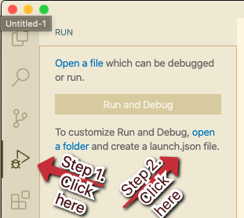
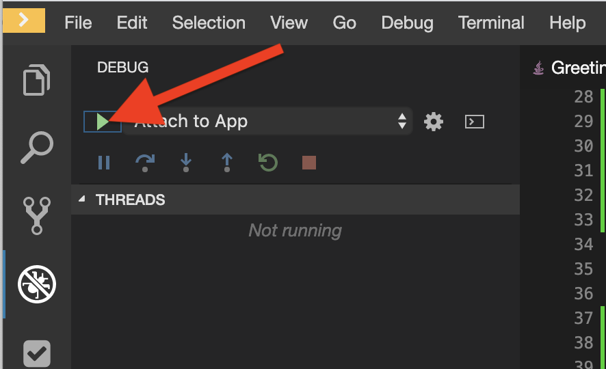
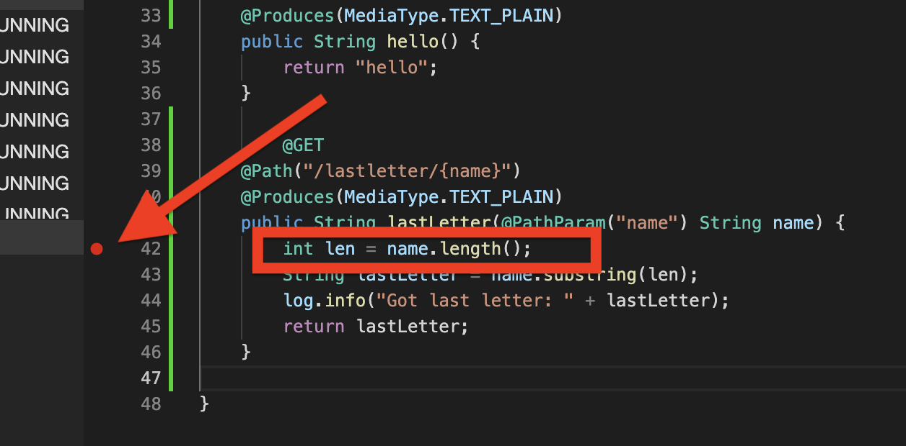
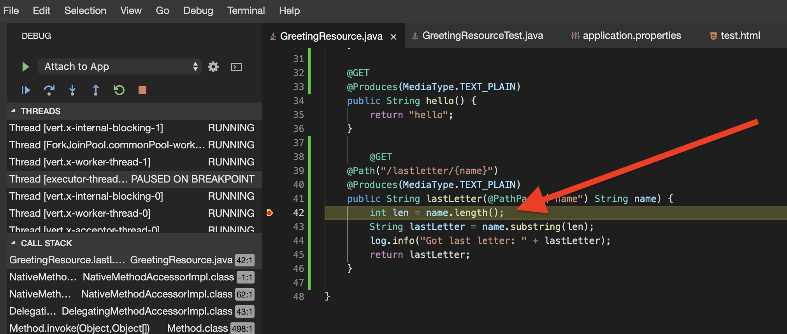
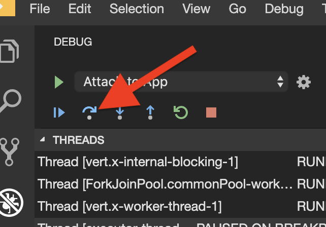
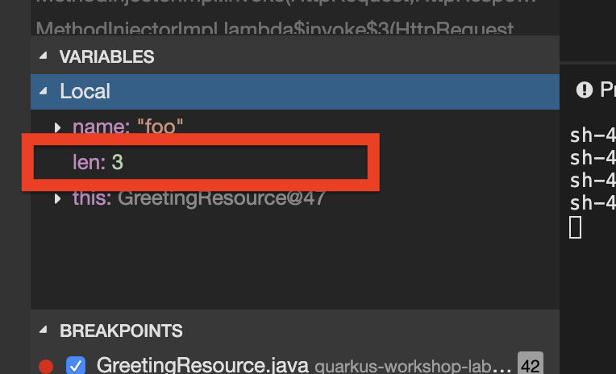
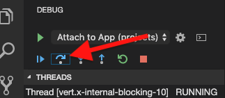
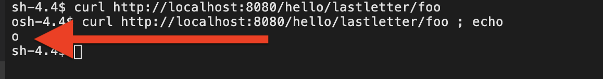
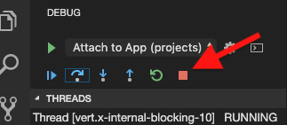

# Welcome to Quarkus Debugging

Debugging is an art of finding errors (bugs) and eradicating (debug) them from a piece of code written in any programming language. Quarkus apps are no different in this regard and you can use the raw Java command line debugger (`jdb`) or, if your IDE supports it, graphical debugging. Most IDEs have integration with Java debuggers, including Eclipse Che, so let’s exercise it.

## Before you begin

Make sure you check-out this repository from git and open it with [VSCode](https://code.visualstudio.com/).

Instructions are based on [VSCode Didact](https://github.com/redhat-developer/vscode-didact), so make sure it's installed
from the VSCode extensions marketplace.

From the VSCode UI, right-click on the `02-Quarkus.CDI.didact.md` file and select "Didact: Start Didact tutorial from File". A new Didact tab will be opened in VS Code.

[Make sure you've checked all the requirements](./requirements.didact.md) before jumping into the tutorial section.

## Checking requirements

<a href='didact://?commandId=vscode.didact.validateAllRequirements' title='Validate all requirements!'><button>Validate all Requirements at Once!</button></a>

| Requirement (Click to Verify)  | Availability | Additional Information/Solution |
| :--- | :--- | :--- |
| [At least one folder exists in the workspace](didact://?commandId=vscode.didact.workspaceFolderExistsCheck&text=workspace-folder-status&completion=A%20valid%20folder%20exists%20in%20the%20workspace. "Ensure that at least one folder exists in the user workspace"){.didact} | *Status: unknown*{#workspace-folder-status} | Create a workspace folder (or [click here to create a temporary folder](didact://?commandId=vscode.didact.createWorkspaceFolder&completion=Created%20temporary%20folder%20in%20the%20workspace. "Create a temporary folder and add it to the workspace."){.didact}), close, and reopen the Didact window
| [Java is accessible at the command line](didact://?commandId=vscode.didact.requirementCheck&text=java-requirements-status$$java%20--version$$Java&completion=Java%20is%20available%20on%20this%20system. "Tests to see if `java -version` returns a result"){.didact} 	| *Status: unknown*{#maven-requirements-status} JDK11 or above required	| See [Installing OpenJDK11](https://developers.redhat.com/products/openjdk/download "Download OpenJDK11 on your system") and then restart VS Code
| [Apache Maven is accessible at the command line](didact://?commandId=vscode.didact.requirementCheck&text=maven-requirements-status$$mvn%20--version$$Apache%20Maven&completion=Apache%20Maven%20is%20available%20on%20this%20system. "Tests to see if `mvn -version` returns a result"){.didact} 	| *Status: unknown*{#maven-requirements-status} MAVEN3.2 or above required	| See [Installing Apache Maven](https://maven.apache.org/install.html "Documentation on how to Install Apache Maven on your system") and then restart VS Code
| [VS Code Extension Pack for Apache Camel by Red Hat is installed](didact://?commandId=vscode.didact.extensionRequirementCheck&text=extension-requirement-status$$redhat.apache-camel-extension-pack&completion=Camel%20extension%20pack%20available. "Checks the VS Code workspace to make sure the extension pack is installed"){.didact} | *Status: unknown*{#extension-requirement-status} OPTIONAL	| [Click here to install](vscode:extension/redhat.apache-camel-extension-pack "Opens the extension page and provides an install link") 
| [Check if the Quarkus Tools for Visual Studio Code Extension Pack by Red Hat is installed](didact://?commandId=vscode.didact.extensionRequirementCheck&text=extension-requirement-status$$redhat.vscode-quarkus&completion=Quarkus%20extension%20pack%20is%20available%20on%20this%20system. "Checks the VS Code workspace to make sure the extension pack is installed"){.didact} | *Status: unknown*{#extension-requirement-status} | The Quarkus Tools for Visual Studio Code Extension Pack by Red Hat provides a collection of useful tools for Quarkus developers, such as code completion and integrated lifecycle management. You can install it from the VS Code Extensions marketplace. 
| [Check if the OpenShift CLI ("oc") is installed](didact://?commandId=vscode.didact.cliCommandSuccessful&text=oc-requirements-status$$oc%20help&completion=Checked%20oc%20tool%20availability "Tests to see if `oc help` returns a 0 return code"){.didact} | *Status: unknown*{#oc-requirements-status} OPTIONAL | The OpenShift CLI tool ("oc") will be used to interact with the OpenShift cluster.
| [Check if you're connected to an OpenShift cluster](didact://?commandId=vscode.didact.requirementCheck&text=cluster-requirements-status$$oc%20get%20project$$NAME&completion=OpenShift%20is%20connected. "Tests to see if `oc get projects` returns a result"){.didact} | *Status: unknown*{#cluster-requirements-status} OPTIONAL | You need to connect to an OpenShift cluster in order to run the examples.

## 1. Quick Peek - Quarkus Debugging

Let’s introduce a subtle off-by-one bug in our application and use the debugger to debug it.

We made a copy of `GreetingResource.java` class ([open](didact://?commandId=vscode.openFolder&projectFilePath=src/main/java/org/acme/people/rest/GreetingResource.java&completion=Opened%20the%20GreetingResource.java%20file "Opens the GreetingResource.java file"){.didact}) and made `GreetingResourceError.java` class

Open up the `GreetingResourceError.java` class ([open](didact://?commandId=vscode.openFolder&projectFilePath=src/main/java/org/acme/people/rest/GreetingResourceError.java&completion=Opened%20the%20GreetingResourceError.java%20file "Opens the GreetingResourceError.java file"){.didact}), and add another RESTful endpoint that returns the last letter in a name.

A bug has been reported where the last letter is not working. To reproduce the bug, try to retrieve the last letter of the string `Foo` by running this in a Terminal (your app should still be running - if it is not, use *Start Live Coding* again):

## 2. Running in Dev Mode - Quarkus Last Letter 

Let's use **Live Coding** 

You can use the `mvn` (Maven) command below to run Quarkus apps in dev mode.

```
mvn compile quarkus:dev
```

([^ execute](didact://?commandId=vscode.didact.sendNamedTerminalAString&text=QuarkusTerm$$mvn%20compile%20quarkus:dev&completion=Run%20live%20coding. "Opens a new terminal and sends the command above"){.didact})

open [localhost:8080/hello/lastletter/Foo](http://localhost:8080/hello/lastletter/Foo) in your browser or you can also do a curl on a separate terminal

```
curl http://localhost:8080/hello/lastletter/Foo
```
([^ execute](didact://?commandId=vscode.didact.sendNamedTerminalAString&text=curlTerm$$curl%20http://localhost:8080/hello/lastletter/Foo%20;%20echo%20''&completion=Run%20curl%20command. "Opens a new terminal and sends the command above"){.didact})


Due to the bug, nothing is returned from curl. It should have given us back an `o`. You’ll also see `Got last letter: ` in the console output of the Quarkus app terminal.

You can probably spot the bug right away but let’s see how you could find this with the debugger, and more importantly fix it and re-test very quickly.

## 3. Attach debugger
In Live Coding mode, Quarkus apps also listen for debugger connections on port `5005`. Your app should still be running.

To connect to the running app, access the debugger by clicking on the debug icon:




In the launch.json file ([open](didact://?commandId=vscode.openFolder&projectFilePath=.vscode/launch.json&completion=Opened%20the%20launch.json%20file "Opens the launch.json file"){.didact}), copy-paste the content below (if the launch.json exists , make sure the content matches)

```
{
    "version": "0.2.0",
    "configurations": [
      {
          "type": "java",
          "request": "attach",
          "name": "Attach to App",
          "hostName": "localhost",
          "port": 5005
      }
  ]
  }
```
The debugger view will appear with several small buttons used to start/stop execution, step into/over/out of code, and other operations. Ensure that *Attach to App* is selected in the drop-down, and click the *Start Debugging* button to attach the debugger to the app:



## 4. Set a Breakpoint 

To debug the app, let’s step through our function that has the bug. In the left gutter of the code, to the left of the line numbers, click once next to `int len = name.length();` to set a breakpoint and cause a red circle to appear:



## 5. Trigger the bug

Now that we have a breakpoint, in a Terminal issue the same `curl` command as before:

open [localhost:8080/hello/lastletter/Foo](http://localhost:8080/hello/lastletter/Foo) in your browser or you can also do a curl on a separate terminal

```
curl http://localhost:8080/hello/lastletter/Foo
```
([^ execute](didact://?commandId=vscode.didact.sendNamedTerminalAString&text=curlTerm$$curl%20http://localhost:8080/hello/lastletter/Foo%20;%20echo%20''&completion=Run%20curl%20command. "Opens a new terminal and sends the command above"){.didact})

This time, the command will appear to hang as the breakpoint has been reached. The line where you set the breakpoint will be highlighted:



You will see four main sections of the debug view:

- **Threads** - A list of active threads at the point where the breakpoint was reached.

- **Call Stack** - This is an ordered list of *stack frames* showing the path through the code from the beginning of the thread to the current location in our code.

- **Variables** - Here you can see the value of *local* variables in the selected stack frame. In our code we have no local variables defined yet, but once we start stepping through the code, newly defined variables (like `len`) will appear here.

- **Breakpoints** - This lists the breakpoints you’ve set. Each Breakpoint can be further configured, or selectively disabled, by right-clicking on the breakpoint in the breakpoint list.

Step over the current line by clicking **Step Over**:



This will fully execute the current line, and advance to the next line in the code and stop again. (You could also step into methods for deeper debugging).

At this point, `len` is defined (and listed on the right side):




Click **Step Over** again, which executes the line to grab the last letter using `len` an offset to the `substring` method. See the bug? Look at the value of `lastLetter` in the variables list on the right - it’s empty!

We need to pass an offset that is one *before* the end, to get the last letter.

Click the **Continue** button to let the method continue, log the erroneous value to the console, and return the value (your `curl` command may have timed out).



## 5. Fix the bug

Fix the code by changing the line that calls `substring()` to read:
```
        String lastLetter = name.substring(len - 1);
```        
With the bug fixed, re-trigger the method by running the `curl` command again in a Terminal:

```
curl http://localhost:8080/hello/lastletter/Foo
```
([^ execute](didact://?commandId=vscode.didact.sendNamedTerminalAString&text=curlTerm$$curl%20http://localhost:8080/hello/lastletter/Foo%20;%20echo%20''&completion=Run%20curl%20command. "Opens a new terminal and sends the command above"){.didact})

The breakpoint will be hit once again. Step over the lines to verify the value of `lastLetter` is correct and you see a proper `Got last letter: o` on the console. before the method returns. You’ve fixed the bug!



Remove the breakpoint by clicking on the red circle to de-highlight it. Run the `curl` command once more to see the full bugfix which should return the last letter of the generated name now: You should see `o`.

Click **Stop** button to quit the debugging session.



## 8. Cleanup

[**Click here to exit the current command**](didact://?commandId=vscode.didact.sendNamedTerminalCtrlC&text=QuarkusTerm&completion=Quarkus%20K%20Hello%20World%20interrupted. "Interrupt the current operation on the terminal"){.didact},
or hit `ctrl+c` on the terminal window.

## 7. Congratulations!

Quarkus apps are just like any other Java app, so debugging is straightforward and supported by many IDEs and CLIs out there. Combined with Live Reload, it makes development quick and (relatively) painless!
