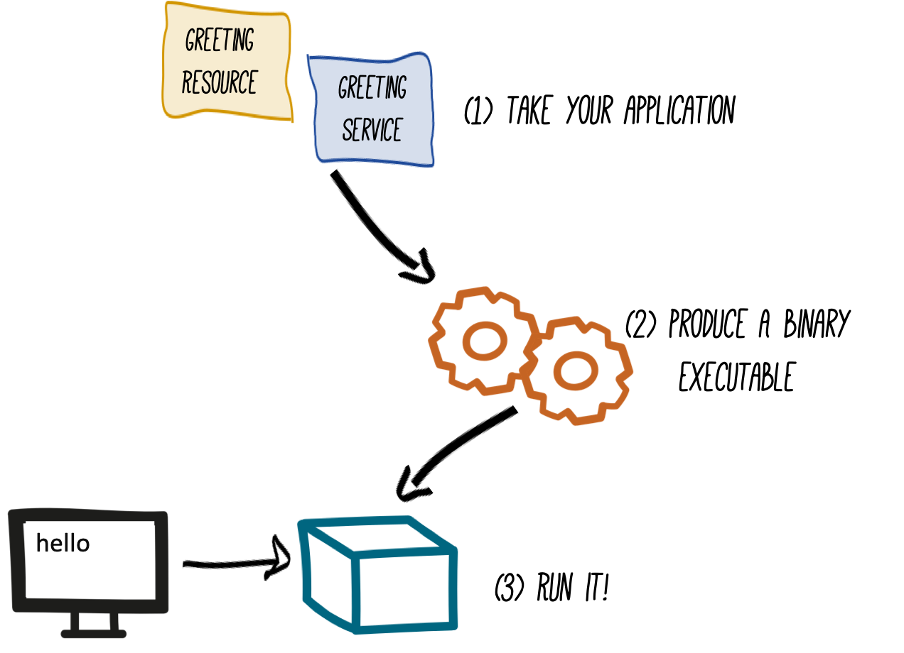

# Welcome to Quarkus - Building Native Apps

Let’s now produce a native executable for our application. It improves the startup time of the application, and produces a minimal disk and memory footprint. The executable would have everything to run the application including the "JVM" (shrunk to be just enough to run the application), and the application. This is accomplished using `GraalVM`.

GraalVM is a universal virtual machine for compiling and running applications written in JavaScript, Python, Ruby, R, JVM-based languages like Java, Scala, Groovy, Kotlin, Clojure, and LLVM-based languages such as C and C++. It includes ahead-of-time compilation, aggressive dead code elimination, and optimal packaging as native binaries that moves a lot of startup logic to build-time, thereby reducing startup time and memory resource requirements significantly.



Installing GraalVM is a pre-requisite for you to run this lab. Inspect the value of the `GRAALVM_HOME` variable in the Terminal with:
```
echo $GRAALVM_HOME
```
([^ execute](didact://?commandId=vscode.didact.sendNamedTerminalAString&text=QNativeTerm$$echo%20$GRAALVM_HOME&completion=echo%20graalvm%20home. "Opens a new terminal and sends the command above"){.didact})

## 1. Build the image

Within the `pom.xml`([open](didact://?commandId=vscode.openFolder&projectFilePath=pom.xml&completion=Opened%20the%20pom.xml%20file "Opens the pom.xml file"){.didact})is the declaration for the Quarkus Maven plugin which contains a profile for `native-image`:

```
  <profile>
    <id>native</id>
    <build>
      <plugins>
        <plugin>
          <groupId>io.quarkus</groupId>
          <artifactId>quarkus-maven-plugin</artifactId>
          <version>${quarkus.version}</version>
          <executions>
            <execution>
              <goals>
                <goal>native-image</goal>
              </goals>
              <configuration>
                <enableHttpUrlHandler>true</enableHttpUrlHandler>
              </configuration>
            </execution>
          </executions>
        </plugin>
      </plugins>
    </build>
  </profile>
```

We use a profile because, you will see very soon, packaging the native image takes a few seconds. However, this compilation time is only incurred once, as opposed to every time the application starts, which is the case with other approaches for building and executing JARs.

Create a native executable by using the command below:

```
mvn -DskipTests clean package -Pnative
```

([^ execute](didact://?commandId=vscode.didact.sendNamedTerminalAString&text=QuarkusTerm$$mvn%20-Dskiptests%20clean%20package%20-Pnative&completion=Run%20Quarkus%20native%20mode. "Opens a new terminal and sends the command above"){.didact})

> You may get a MAVEN NUILD FAILURE
>[INFO] BUILD FAILURE
>[INFO] ------------------------------------------------------------------------
>[INFO] Total time:  11.550 s
>[INFO] Finished at: 2020-04-11T11:28:20-04:00
>[INFO] ------------------------------------------------------------------------
>[ERROR] Failed to execute goal io.quarkus:quarkus-maven-plugin:1.3.2.Final:native-image (default) on project people: Failed to generate >native image: io.quarkus.builder.BuildException: Build failure: Build failed due to errors
>[ERROR]         [error]: Build step io.quarkus.deployment.pkg.steps.NativeImageBuildStep#build threw an exception: java.lang.>RuntimeException: Cannot find the `native-image` in the GRAALVM_HOME, JAVA_HOME and System PATH. Install it using `gu install >native-image`
>
> Please run the command `gu install native-image` and re-run the mvn clean package again

This will take about 2-3 minutes to finish. Wait for it!. In the end you should get a *BUILD SUCCESS* message.

>Since we are on Linux in this environment, and the OS that will eventually run our application is also Linux, we can use our local OS to build the native Quarkus app. If you need to build native Linux binaries when on other OS’s like Windows or Mac OS X, you can use `-Dquarkus.native.container-runtime=[podman | docker]`. You’ll need either `Docker` or `Podman` installed depending on which runtime you want to use!


In addition to the regular files, the build will produce `target/people-1.0-SNAPSHOT-runner`. This is a native Linux binary. Not a shell script, or a JAR file, but a native binary.

## 2. Run native image

Since our environment here is Linux/mac, you can *just run it*. In the terminal, run:

```
target/people-1.0-SNAPSHOT-runner
```
([^ execute](didact://?commandId=vscode.didact.sendNamedTerminalAString&text=QuarkusTerm$$target/people-1.0-SNAPSHOT-runner&completion=Running%20native%20image. "Opens a new terminal and sends the command above"){.didact})

> **Note** We use -Dquarkus.http.port=8081 to avoid conflicting with port 8080 used for Live Coding mode

Notice the amazingly fast startup time:

```
2019-07-10 04:04:11,817 INFO  [io.quarkus] (main) Quarkus xx.xx.xx started in 0.015s. Listening on: http://[::]:8081
That’s 15 milliseconds to start up.
```

open [localhost:8081/hello/greeting/quarkus](http://localhost:8081/hello/greeting/quarkus) in your browser or you can also do a curl on a separate terminal

```
curl http://localhost:8081/hello/greeting/quarkus
```
([^ execute](didact://?commandId=vscode.didact.sendNamedTerminalAString&text=curlTerm$$curl%20http://localhost:8081/hello/greeting/quarkus%20;%20echo%20''&completion=Run%20curl%20command. "Opens a new terminal and sends the command above"){.didact})

And extremely low memory usage as reported by the Linux/mac `ps` utility. While the app is running, open another Terminal and run:

```
ps -o pid,rss,command -p $(pgrep -f runner)
```
([^ execute](didact://?commandId=vscode.didact.sendNamedTerminalAString&text=QNativeTerm$$ps%20-o%20pid,rss,command%20-p%20$(pgrep%20-f%20runner)&completion=Show%20graalvm%20memory. "Opens a new terminal and sends the command above"){.didact})


You should see something like:

```
   PID   RSS COMMAND
 16017 53816 target/people-1.0-SNAPSHOT-runner
```

This shows that our process is taking around 50 MB of memory (`Resident Set Size`, or RSS). Pretty compact!

>The RSS and memory usage of any app, including Quarkus, will vary depending your specific environment, and will rise as the application experiences load.

Nice!

## 3. Cleanup

Go to the Terminal in which you ran the native app and press CTRL+C to stop our native app. Be sure to leave your Live Coding Terminal open!

[**Click here to exit the current command**](didact://?commandId=vscode.didact.sendNamedTerminalCtrlC&text=QuarkusTerm&completion=Quarkus%20K%20Hello%20World%20interrupted. "Interrupt the current operation on the terminal"){.didact},
or hit `ctrl+c` on the terminal window.

## 4. Congratulations!

You’ve now built a Java application as an executable JAR and a Linux native binary. We’ll explore the benefits of native binaries later in when we start deploying to Kubernetes.
