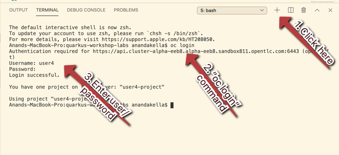
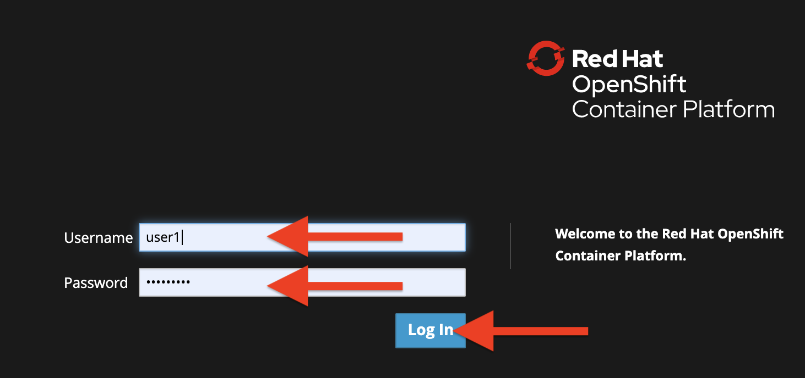
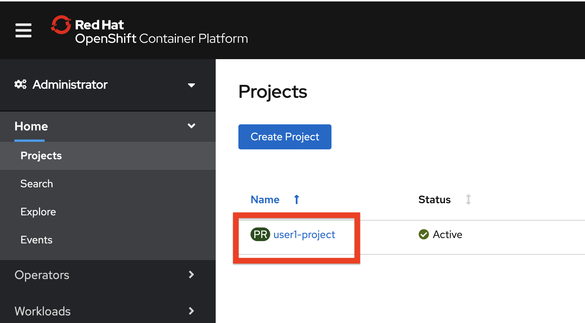
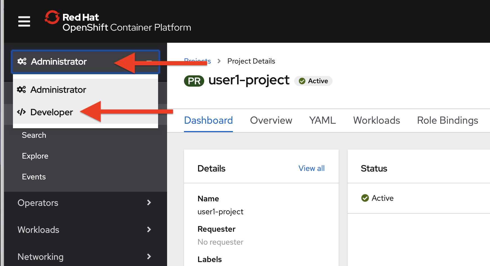
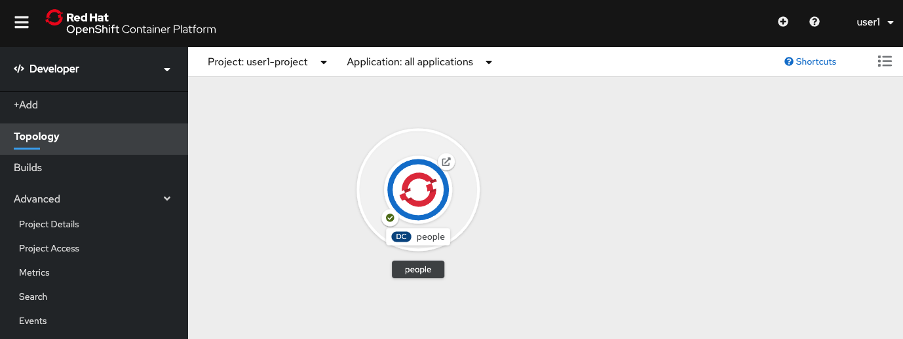
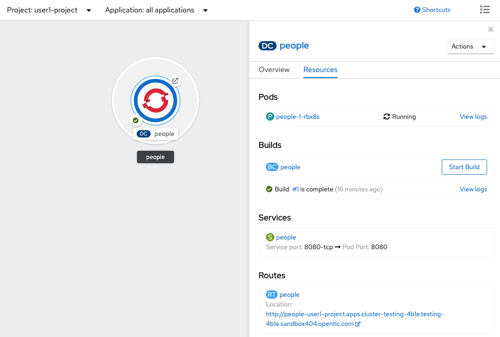
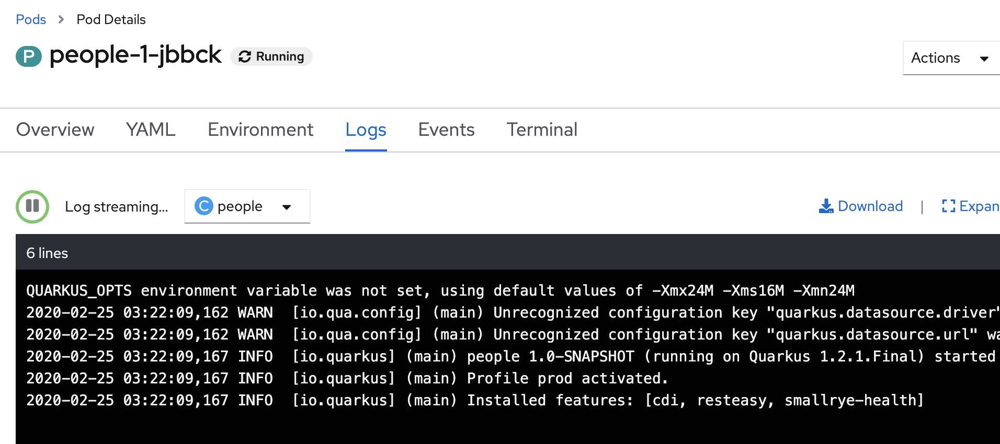
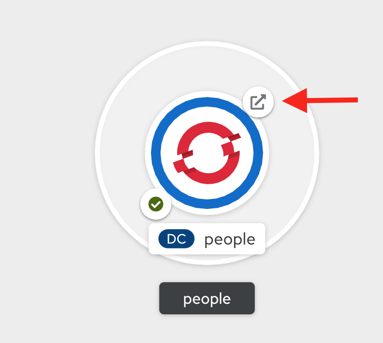
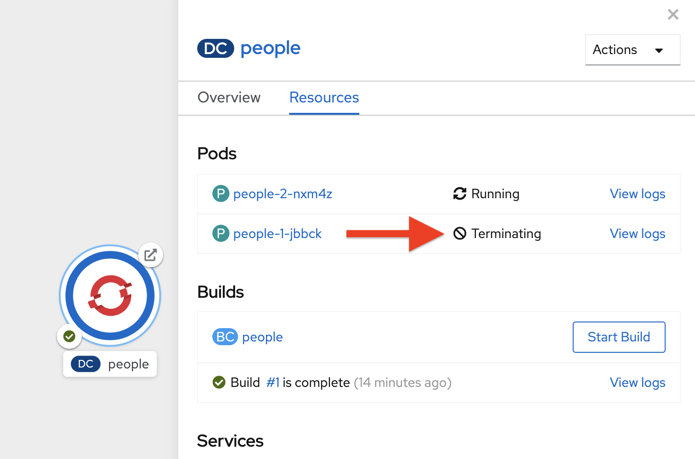

# Welcome to Quarkus - Deploying to the Cloud

With our app fully ready for its first cloud native deployment, let’s package it up for deployment to our Kubernetes platform as a native image. OpenShift is a commercially supported distribution of Kubernetes from Red Hat. 

## 1. Approaches to Deploy to OpenShift
We can use two approaches to deploy to OpenShift. 

- Source-2-Image (S2I) Approach
- Binary Approach

Both approaches are based on the source-to-image (S2I) feature, it may sound strange having a binary option. Actually, both workflows rely on S2I builds using the Source strategy. The key difference is that the S2I approach generates deployable artifacts of your application inside OpenShift, while the binary approach generates these binary artifacts outside OpenShift. Both of them build the application container image inside OpenShift. We will work through both of them below.

Before we get started, let us copy the values from `application.properties.openshift` ([open](didact://?commandId=vscode.openFolder&projectFilePath=src/main/resources/application.properties.openshift&completion=Opened%20the%20application.properties.openshift%20file "Opens the application.properties.openshift file"){.didact}) into `application.properties` ([open](didact://?commandId=vscode.openFolder&projectFilePath=src/main/resources/application.properties&completion=Opened%20the%20application.properties%20file "Opens the application.properties file"){.didact}) file.

## 2. Source-2-Image (S2I) Approach

When using the S2I approach, developers would rely on the OpenShift client (the oc command).

- Clone the project to a local folder, so they can change the code to their liking and maybe test it outside of OpenShift.
- Commit and push any changes to the origin git repository. Note that I am using a specific git repository below, please change the url appropriately.
    - Copy the content from application.properties.openshift file ([open](didact://?commandId=vscode.openFolder&projectFilePath=src/main/resources/application.properties.openshift&completion=Opened%20the%20application.properties.openshift%20file "Opens the application.properties.openshift file"){.didact}) and paste them in the application.properties file ([open](didact://?commandId=vscode.openFolder&projectFilePath=src/main/resources/application.properties&completion=Opened%20the%20application.properties%20file "Opens the application.properties file"){.didact})
- Log in to OpenShift and create a new project or be in the right project as needed.
    - `oc login`([^ execute](didact://?commandId=vscode.didact.sendNamedTerminalAString&text=ocTerm$$oc%20login&completion=Run%20oc%20login%20command. "Opens a new terminal and sends the command above"){.didact})(enter the proper username and password)
    - `oc project xxxx` (select the project where you want the Quarkus demo deployments)
- Use the oc new-app command to build the container image and create the OpenShift resources that describe the application.
    - `oc new-app quay.io/quarkus/ubi-quarkus-native-s2i:19.3.1-java11~https://github.com/aakella1/quarkus-workshop-labs.git --name=quarkus-demo` ([^ execute](didact://?commandId=vscode.didact.sendNamedTerminalAString&text=ocTerm$$oc%20new-app%20quay.io/quarkus/ubi-quarkus-native-s2i:19.3.1-java11~https://github.com/aakella1/quarkus-workshop-labs.git%20--name=quarkus-demo&completion=Run%20oc%20new-app%20command. "Opens a new terminal and sends the command above"){.didact})
- The OpenShift client command creates OpenShift resources to build and deploy the application.
- The build configuration resource starts a source build that runs Maven to generate the application package (JAR) and create the application container image containing the application package. You can trace the logs using the command below.
    - `oc logs -f bc/quarkus-demo` ([^ execute](didact://?commandId=vscode.didact.sendNamedTerminalAString&text=ocTerm$$oc%20logs%20-f%20bc/quarkus-demo&completion=Run%20oc%20logs%20command. "Opens a new terminal and sends the command above"){.didact})
    - Note that this step may take upto 5 minutes
- Expose the application service to the outside world.
    - `oc get svc` ([^ execute](didact://?commandId=vscode.didact.sendNamedTerminalAString&text=ocTerm$$oc%20get%20svc&completion=Run%20oc%20get%20svc%20command. "Opens a new terminal and sends the command above"){.didact})
    - `oc expose svc/quarkus-demo` ([^ execute](didact://?commandId=vscode.didact.sendNamedTerminalAString&text=ocTerm$$oc%20expose%20svc/quarkus-demo&completion=Run%20oc%20expose%20svc%20command. "Opens a new terminal and sends the command above"){.didact})
- Use either curl or a web browser to test the application.
    - `curl $(oc get route quarkus-demo -o=go-template --template='{{ .spec.host }}')/hello/greeting/quarkus-on-openshift; echo ''` ([^ execute](didact://?commandId=vscode.didact.sendNamedTerminalAString&text=curlTerm$$curl%20$(oc%20get%20route%20quarkus-demo%20-o=go-template%20--template='{{.spec.host}}')/hello/greeting/quarkus-on-openshift;echo%20''&completion=Run%20curl%20command. "Opens a new terminal and sends the command above"){.didact})

From an operational perspective, the main difference between the approaches lies between using the mvn command or the oc new-app command

## 3. Binary Approach

The binary workflow relies on Maven to perform the heavy lifting, which most Java developers appreciate.

When using the binary approach, developers would:

- Clone the project to a local folder, so they can change the code to their liking and maybe test it outside of OpenShift.
- Log in to OpenShift and create a new project or be in the right project as needed.
- Use the mvn command, which in turn uses the Fabric8 Maven Plug-in (FMP) to build the container image and create the OpenShift resources that describe the application. Maven performs the following tasks:
    - Generates the application package (an executable JAR)
    - Starts a binary build that creates the application container image, and streams the application package to the build pod
    - Creates OpenShift resources to deploy the application
    - Use either curl or a web browser to test the application.

Let us walk through the steps below

to start with, Copy the content from application.properties.openshift file ([open](didact://?commandId=vscode.openFolder&projectFilePath=src/main/resources/application.properties.openshift&completion=Opened%20the%20application.properties.openshift%20file "Opens the application.properties.openshift file"){.didact}) and paste them in the application.properties file ([open](didact://?commandId=vscode.openFolder&projectFilePath=src/main/resources/application.properties&completion=Opened%20the%20application.properties%20file "Opens the application.properties file"){.didact})

### 1.Build native image

Keep in mind, we can package and deploy our application to a JVM. 
But our goal is to leverage the "native image" capabilities of graalvm. This image would be much smaller in size, quicker to start-up and occupies less memory.

Let’s rebuild our native image with all our changes thus far. Run the *Build Native App* command again:

```
mvn -DskipTests clean package -Pnative -Dquarkus.native.container-build=true
```

([^ execute](didact://?commandId=vscode.didact.sendNamedTerminalAString&text=QNativeTerm$$mvn%20-Dskiptests%20clean%20package%20-Pnative%20-Dquarkus.native.container-build=true&completion=Run%20Quarkus%20native%20mode. "Opens a new terminal and sends the command above"){.didact})

As you recall, the output of this process is a native Linux binary (as we have the option `-Dquarkus.native.container-build=true`). Let’s deploy it to our cluster.

### 2.Login to OpenShift in VSCode terminal

In Visual Studio Code, login to OpenShift as shown in the diagram below:

- `oc login`(enter the proper username and password)([^ execute](didact://?commandId=vscode.didact.sendNamedTerminalAString&text=ocTerm$$oc%20login&completion=Run%20oc%20login%20command. "Opens a new terminal and sends the command above"){.didact})(enter the proper username and password)
- `oc project xxxx` (select the project where you want the Quarkus demo deployments)



### 3. Deploy to OpenShift

First, create a new binary build within OpenShift by opening a Terminal and running:
```
oc new-build quay.io/quarkus/ubi-quarkus-native-binary-s2i:19.3.1 --binary  --name=people -l app=people 
```
([^ execute](didact://?commandId=vscode.didact.sendNamedTerminalAString&text=ocTerm$$oc%20new-build%20quay.io/quarkus/ubi-quarkus-native-binary-s2i:19.3.1%20--binary%20--name=people%20-l%20app=people&completion=Run%20oc%20new-build%20command. "Opens a new terminal and sends the command above"){.didact})

You should get a `-→ Success` message at the end.

> This build uses the new Red Hat Universal Base Image, providing foundational software needed to run most applications, while staying at a reasonable size.

And then start and watch the build, which will take about a minute to complete:
```
oc start-build people --from-file target/*-runner --follow
```
([^ execute](didact://?commandId=vscode.didact.sendNamedTerminalAString&text=ocTerm$$oc%20start-build%20people%20--from-file%20target/*-runner%20--follow&completion=Run%20oc%20start-build%20command. "Opens a new terminal and sends the command above"){.didact})

This step will combine the native binary with a base OS image, create a new container image, and push it to an internal image registry. Wait for it to finish!. You should get a Push successful message at the end.

Once that’s done, deploy the new image as an OpenShift application and expose its HTTP endpoint to the outside world:
```
oc new-app people -l "app.openshift.io/runtime=quarkus,app.kubernetes.io/part-of=people" 
```
([^ execute](didact://?commandId=vscode.didact.sendNamedTerminalAString&text=ocTerm$$oc%20new-app%20people%20-l%20"app.openshift.io/runtime=quarkus,app.kubernetes.io/part-of=people"&completion=Run%20oc%20new-app%20command. "Opens a new terminal and sends the command above"){.didact})
```
oc expose svc/people
```
([^ execute](didact://?commandId=vscode.didact.sendNamedTerminalAString&text=ocTerm$$oc%20expose%20svc/people&completion=Run%20oc%20new-app%20command. "Opens a new terminal and sends the command above"){.didact})

Finally, make sure it’s actually done rolling out:
```
oc rollout status -w dc/people
```
([^ execute](didact://?commandId=vscode.didact.sendNamedTerminalAString&text=ocTerm$$oc%20rollout%20status%20-w%20dc/people&completion=Run%20oc%20rollout%20command. "Opens a new terminal and sends the command above"){.didact})

> dc in dc/people is shorthand for OpenShift’s DeploymentConfig object type. There are other shortcuts like bc for BuildConfig, svc for Kubernetes Services, and so on.

Wait for that command to report replication controller "people-1" successfully rolled out before continuing.

And now we can access using curl once again. In the Terminal, run this command to access the endpoint:
```
curl $(oc get route people -o=go-template --template='{{ .spec.host }}')/hello/greeting/quarkus-on-openshift
```
 ([^ execute](didact://?commandId=vscode.didact.sendNamedTerminalAString&text=curlTerm$$curl%20$(oc%20get%20route%20people%20-o=go-template%20--template='{{.spec.host}}')/hello/greeting/quarkus-on-openshift;echo%20''&completion=Run%20curl%20command. "Opens a new terminal and sends the command above"){.didact})

You should see:
```
hello quarkus-on-openshift from people-xxxxx
```
## 4. OpenShift console experience

So now our app is deployed to OpenShift. You can also see it in the OpenShift Console. Login with your assigned username and password (e.g. PLEASE ENTER USERID AT TOP OF PAGE/openshift):



Once logged in, click on the name of your project (userNN-project_):


Switch to the Developer Perspective using the upper-left drop-down:



This provides a developer-centric Topology view of applications deployed to the project. You can see the single people deployment that we just deployed earlier using the CLI:



Click on the circle to get details:



Click on the View Logs link to see the console output from the app:



This is the same output you saw earlier when you ran it "locally" with it’s super-fast startup time.

Go back to the Topology view. Since this app is exposed to the world, a Route was created which you can access using the small arrow in the upper right of the circle. Click on the route link:



You can click on the route link to open up the default Quarkus page that’s packaged as part of our workshop application.


## 5. Connect MicroProfile health check

Earlier you implemented a series of MicroProfile health checks. To make OpenShift aware of these available health checks and begin using them, run the following commands in a Terminal in CodeReady:
```
oc set probe dc/people --readiness --initial-delay-seconds=5 --period-seconds=5 --failure-threshold=20 --get-url=http://:8080/health/ready 
```
([^ execute](didact://?commandId=vscode.didact.sendNamedTerminalAString&text=ocTerm$$oc%20set%20probe%20dc/people%20--readiness%20--initial-delay-seconds=5%20--period-seconds=5%20--failure-threshold=20%20--get-url=http://:8080/health/ready&completion=Run%20oc%20set%20probe%20command. "Opens a new terminal and sends the command above"){.didact})
```
oc set probe dc/people --liveness --initial-delay-seconds=5 --period-seconds=5 --failure-threshold=20  --get-url=http://:8080/health/live
```
([^ execute](didact://?commandId=vscode.didact.sendNamedTerminalAString&text=ocTerm$$oc%20set%20probe%20dc/people%20--liveness%20--initial-delay-seconds=5%20--period-seconds=5%20--failure-threshold=20%20--get-url=http://:8080/health/live&completion=Run%20oc%20set%20probe%20command. "Opens a new terminal and sends the command above"){.didact})

You’ll see in the Topology view that the app is re-deployed with the new settings and the old app will be terminated soon after:



This configures both a readiness probe (is the app initialized and ready to serve requests?) and a liveness probe (is the app still up and ready to serve requests) with default timeouts. OpenShift will not route any traffic to pods that don’t respond successfully to these probes. By editing these, it will trigger a new deployment.

At this point, the probes will be accessed periodically to ensure the app is healthy.

## 6. Congratulations

This step covered the deployment of a native Quarkus application on OpenShift. However, there is much more, and the integration with these cloud native platforms (through health checks, configuration management, and monitoring which we’ll cover later) has been tailored to make Quarkus applications execution very smooth.

