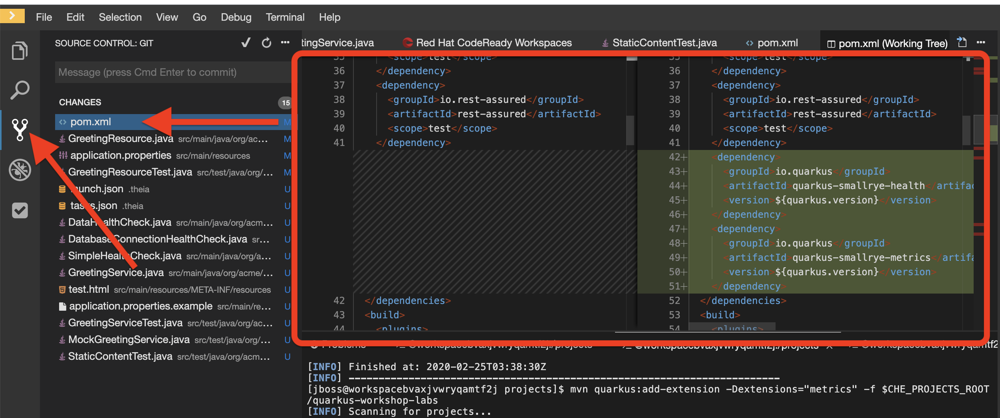

# Using Quarkus extensions

One of the main goals of Quarkus is ease of extensibility and to build a vibrant ecosystem.

Think of Quarkus extensions as your project dependencies. Extensions configure, boot and integrate a framework or technology into your Quarkus application. They also do all of the heavy lifting of providing the right information to GraalVM for your application to compile natively.

Quarkus aims to provide a support for a full extension ecosystem, to make it easy to discover and consume 3rd party extensions, as well as providing easier version management.

## 1. List extensions

Retrieve the list of possible extensions using the Maven plugin. Run this in the Terminal:
```
mvn quarkus:list-extensions -f .
```
([^ execute](didact://?commandId=vscode.didact.sendNamedTerminalAString&text=QuarkusTerm$$mvn%20quarkus:list-extensions%20-f%20.&completion=mvn%20quarkus:list-extensions "Opens a new terminal and sends the command above"){.didact})

You can see the list of ~80 different extensions available to you in the output:
```
Current Quarkus extensions available:
Agroal - Database connection pool                  quarkus-agroal
Amazon DynamoDB                                    quarkus-amazon-dynamodb
Apache Kafka Client                                quarkus-kafka-client
Apache Kafka Streams                               quarkus-kafka-streams
Apache Tika                                        quarkus-tika
```

Adding an extension is similarly easy. With Maven, you can add extensions using `mvn quarkus:add-extension -Dextensions="extension1,extension2,…​"`. The extension name can be the maven groupId/artifactId name of the extension: e.g. `io.quarkus:quarkus-agroal`. But you can pass a partial name and Quarkus will do its best to find the right extension. For example, `agroal`, `Agroal` or `agro` will expand to `io.quarkus:quarkus-agroal`. If no extension is found or if more than one extensions match, you will see a warning and a list of possible matches in the command result.

When you run Quarkus applications, the list of extensions enabled are shown in the output, such as:
```
INFO  [io.quarkus] (main) Installed features: [agroal, cdi, hibernate-orm, jdbc-h2, narayana-jta, resteasy]
```

>In Live Coding mode, Quarkus will monitor the state of `pom.xml` and bring in new dependencies. No need to stop and restart!

## 2. Add an extension

Later on in this lab we’ll be using MicroProfile metrics, so let’s add that extension here. In the Terminal, run the following command to add the *MicroProfile Metrics* extension to your project:
```
mvn quarkus:add-extension -Dextensions="metrics" -f .
```
([^ execute](didact://?commandId=vscode.didact.sendNamedTerminalAString&text=QuarkusTerm$$mvn%20quarkus:add-extension%20-Dextensions="metrics"%20-f%20.&completion=mvn%20quarkus:add-extension "Opens a new terminal and sends the command above"){.didact})

Notice we are using the "short" name `metrics` instead of the fully qualified name `io.quarkus:quarkus-smallrye-metrics`.

The result of this command is a new `<dependency>` added to our `pom.xml` which you can see by looking at the differences you’ve made up till now.

Click on the Source Control view and then double-click on `pom.xml`([open](didact://?commandId=vscode.openFolder&projectFilePath=pom.xml&completion=Opened%20the%20pom.xml%20file "Opens the pom.xml file"){.didact})



You’ll see all the changes to `pom.xml` since you started, including the new extensions we’ve added.

You may see other apparent differences due to whitespace and/or the re-shuffling of XML elements when you ran `mvn quarkus:add-extension`.

There are many other git and GitHub operations like this one that you can perform directly in the IDE for real projects (e.g. committing, branching, merging, push/pull, log viewing, etc).

Go back to the **Explorer** view in VSCode (to see the tree of files once again).

## 3. Writing your own extension

Quarkus extensions add a new developer focused behavior to the core offering, and consist of two distinct parts, buildtime augmentation and runtime container. The augmentation part is responsible for all metadata processing, such as reading annotations, XML descriptors etc. The output of this augmentation phase is recorded bytecode which is responsible for directly instantiating the relevant runtime services.

This means that metadata is only processed once at build time, which both saves on startup time, and also on memory usage as the classes etc that are used for processing are not loaded (or even present) in the runtime JVM.

Writing a Quarkus extension is beyond the scope of this lab, open  [quarkus.io/guides/extension-authors-guide](https://quarkus.io/guides/extension-authors-guide) for more detail on writing your own extension.

## 4. Congratulations

Quarkus aims to provide a support for a full extension ecosystem, open [quarkus.io/extensions](https://quarkus.io/extensions/), to make it easy to discover and consume 3rd party extensions, as well as providing easier version management.

We’ll be adding additional extensions as we go along in other sections of this workshop.
