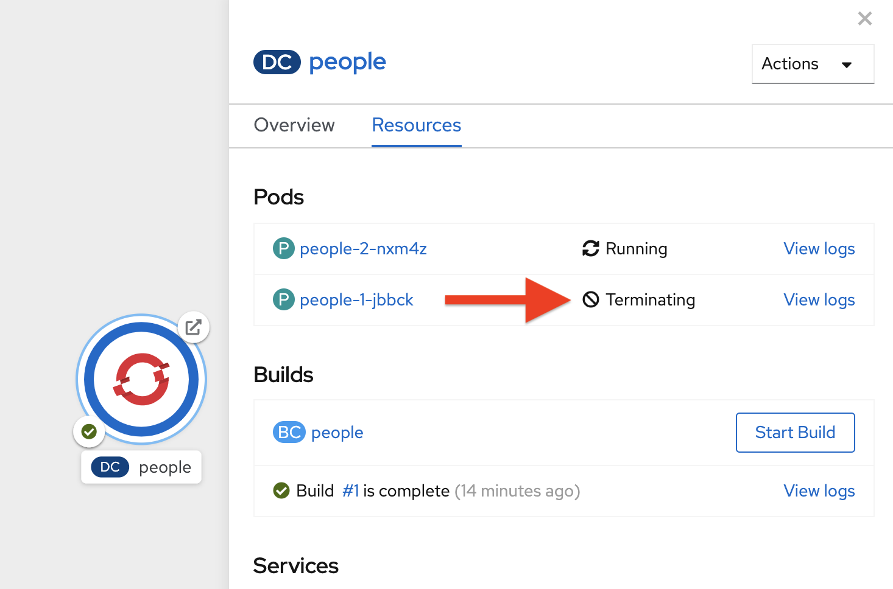

# Hibernate ORM with Panache
Hibernate ORM is the de facto JPA implementation and offers you the full breadth of an Object Relational Mapper. It makes complex mappings possible, but many simple and common mappings can also be complex. Hibernate ORM with **Panache** focuses on making your entities trivial and fun to write and use with Quarkus.

With Panache, we took an opinionated approach to make hibernate as easy as possible. Hibernate ORM with Panache offers the following:

- Auto-generation of IDs (but you can still customize if needed)

- No need for getters/setters. You simply refer to fields directly like `person.name` instead of `person.getName()`. You can still create getters and setters if you need to!

- Lots of super-useful static methods for access like `listAll()`, `find()`, etc.

- No need for custom queries for basic operations, e.g. `Person.find("name", "stef")`

That’s all there is to it: with Panache, Hibernate ORM has never looked so trim and neat.

## 1. People

You may have wondered why we are using `people` in our Java APIs, and now you’ll find out; we’ll be creating a simple data-driven application that manages a set of people, who have a name, birth date, and eye color. In the previous lab we added the extension for Panache to our project, but we will need a few more for connecting to databases. Add these extensions with the following command:

```
mvn quarkus:add-extension -Dextensions="hibernate-orm-panache, jdbc-h2, jdbc-postgresql, resteasy-jsonb" -f .
```
([^ execute](didact://?commandId=vscode.didact.sendNamedTerminalAString&text=QuarkusTerm$$mvn%20quarkus:add-extension%20-Dextensions="hibernate-orm-panache,%20jdbc-h2,%20jdbc-postgresql,%20resteasy-jsonb"%20-f%20.&completion=mvn%20quarkus:add-extension "Opens a new terminal and sends the command above"){.didact})

We’ll use the in-memory H2 database for local testing, and Postgres when we deploy to our production Kubernetes environment. So that’s why we have added in the `h2` and `postgresql` extensions. `resteasy-jsonb` is used to encode JSON objects.

The database connection details (JDBC url, database credentials) are specified in `application.properties` ([open](didact://?commandId=vscode.openFolder&projectFilePath=src/main/resources/application.properties&completion=Opened%20the%20application.properties%20file "Opens the application.properties file"){.didact}) using the Quarkus Profile support. So for example you’ll find this:

```
%prod.quarkus.datasource.url=jdbc:postgresql://postgres-database:5432/person
%prod.quarkus.datasource.driver=org.postgresql.Driver
%dev.quarkus.datasource.url=jdbc:h2:mem:person:default
%dev.quarkus.datasource.driver=org.h2.Driver
%test.quarkus.datasource.url=jdbc:h2:mem:person:default
%test.quarkus.datasource.driver=org.h2.Driver
```

This causes the `%dev` properties (using H2 database) to be active in development (and the `%test` in test mode), and the `%prod` properties (using Postgres) to be used when in production (not in dev or test).

>These names are known to Quarkus, and you can introduce your own profiles and use them in a similar way for other environments (and can be overridden at runtime). You can read more about externalized config in the Quarkus Application Configuration Guide.

## 2. Create Entity

With our extension installed, we can now define our entity using Panache.

We’ll first need the definition of eye colors, so let’s create an `enum`. Open the java class file in `src/main/java/org/acme/people/model` called `EyeColor.java` ([open](didact://?commandId=vscode.openFolder&projectFilePath=src/main/java/org/acme/people/model/EyeColor.java&completion=Opened%20the%20EyeColor.java%20file "Opens the Eyecolor.java file"){.didact}), and go through the enum definition:
```
package org.acme.people.model;

public enum EyeColor {
    BLUE, GREEN, HAZEL, BROWN
}
```

This app will be a database of people, each of which have a name, birthdate, and eye color. We’ll need an entity, so open up the `src/main/java/org/acme/people/model/Person.java` file ([open](didact://?commandId=vscode.openFolder&projectFilePath=src/main/java/org/acme/people/model/Person.java&completion=Opened%20the%20Person.java%20file "Opens the Person.java file"){.didact}), and check code in the file 

As you can see we’ve defined the three fields `name`, `birth`, and `eyes`. We’re using the Java Persistence API’s `@Enumerated` field type for our eye color.

## 3. Define RESTful endpoint

Next, open the `PersonResource` class ([open](didact://?commandId=vscode.openFolder&projectFilePath=src/main/java/org/acme/people/rest/PersonResource.java&completion=Opened%20the%20PersonResource.java%20file "Opens the PersonResource.java file"){.didact}) which we will use for our RESTful endpoint:

As you can see we’ve implemented our first Panache-based query, the `getAll` method, which will return our list of people as a JSON object when we access the `GET /person` endpoint. This is defined using standard JAX-RS `@Path` and `@GET` and `@Produces` annotations.

## 4. Add sample data

Let’s add some sample data to the database so we can test things out. Open the file `src/main/resources/import.sql` ([open](didact://?commandId=vscode.openFolder&projectFilePath=src/main/resources/import.sql&completion=Opened%20the%20import.sql%20file "Opens the import.sql file"){.didact}) and add some SQL statements to the file to run on startup:

Check the entries in `import.sql`. These statements will add some fake people to our database on startup.

# 5. Test the app

If the live coding is not running, you can use the `mvn` (Maven) command below to run Quarkus apps in dev mode.

```
mvn compile quarkus:dev
```

([^ execute](didact://?commandId=vscode.didact.sendNamedTerminalAString&text=QuarkusTerm$$mvn%20compile%20quarkus:dev&completion=Run%20live%20coding. "Opens a new terminal and sends the command above"){.didact})

Let’s try out our first RESTful endpoint to retrieve all the sample users. Open up a separate Terminal and issue the following command:
```
curl -s http://localhost:8080/person | jq
```
([^ execute](didact://?commandId=vscode.didact.sendNamedTerminalAString&text=curlTerm$$curl%20http://localhost:8080/person|%20jq&completion=Run%20curl%20command. "Opens a new terminal and sends the command above"){.didact})

We call the endpoint with `curl` then send the output through `jq` to make the output prettier. You should see:
```
[
  {
    "id": 1,
    "birth": "1974-08-15",
    "eyes": "BLUE",
    "name": "Farid Ulyanov"
  },
  {
    "id": 2,
    "birth": "1984-05-24",
    "eyes": "BROWN",
    "name": "Salvador L. Witcher"
  },
  {
    "id": 3,
    "birth": "1999-04-25",
    "eyes": "HAZEL",
    "name": "Kim Hu"
  }
]
```

It’s working! Note that the `id` field was added to our entity, but never appear in our query APIs and can be safely ignored most of the time.

>Advanced use cases may require a custom ID strategy, which can by done by extending `PanacheEntityBase` instead of `PanacheEntity`, and declaring a public `id` field with the necessary policy. For example (do not copy this code into your app):
>
>```
>@Id
>@SequenceGenerator(
>          name = "personSequence",
>          sequenceName = "person_id_seq",
>          allocationSize = 1,
>          initialValue = 4)
>@GeneratedValue(strategy = GenerationType.SEQUENCE, generator = >"personSequence")
>public Integer id;
>```

## 6. Add Basic Queries

Let’s modify the application and add some queries. Much like traditional object-oriented programming, Panache and Quarkus recommend you place your custom entity queries as close to the entity definition as possible, in this case in the entity definition itself. Open the `Person` entity class ([open](didact://?commandId=vscode.openFolder&projectFilePath=src/main/java/org/acme/people/model/Person.java&completion=Opened%20the%20Person.java%20file "Opens the Person.java file"){.didact})(it’s in the `org.acme.person.model` package), and check the following code under the `// TODO: Adding more queries` comment:

```
public static List<Person> findByColor(EyeColor color) {
    return list("eyes", color);
}

public static List<Person> getBeforeYear(int year) {
    return Person.<Person>streamAll()
    .filter(p -> p.birth.getYear() <= year)
    .collect(Collectors.toList());
}
```

These two queries will find a list of people in our database based on eye color, or birth year. Note the `getBeforeYear` is implemented using the Java Streams API.

>All list methods in Panache-based entities (those that extend from `PanacheEntity`) have equivalent stream versions. So `list` has a stream variant, `listAll` -→`streamAll` and so on.

With our custom entity queries implemented in our `Person` entity class, let’s add RESTful endpoints to `PersonResource` to access them.

Open the `PersonResource` class ([open](didact://?commandId=vscode.openFolder&projectFilePath=src/main/java/org/acme/people/rest/PersonResource.java&completion=Opened%20the%20PersonResource.java%20file "Opens the PersonResource.java file"){.didact}) and check two news endpoint under the `//TODO: adding basic queries` comment:

```
@GET
@Path("/eyes/{color}")
@Produces(MediaType.APPLICATION_JSON)
public List<Person> findByColor(@PathParam(value = "color") EyeColor color) {
    return Person.findByColor(color);
}

@GET
@Path("/birth/before/{year}")
@Produces(MediaType.APPLICATION_JSON)
public List<Person> getBeforeYear(@PathParam(value = "year") int year) {
    return Person.getBeforeYear(year);
}
```

## 7. Inspect the results

Check that it works as expected by testing the new endpoints. Let’s find all the people with `BLUE` eyes. Execute in your Terminal:

```
curl -s http://localhost:8080/person/eyes/BLUE | jq
```
([^ execute](didact://?commandId=vscode.didact.sendNamedTerminalAString&text=curlTerm$$curl%20http://localhost:8080/person/eyes/BLUE|%20jq&completion=Run%20curl%20command. "Opens a new terminal and sends the command above"){.didact})

You should only see **one** person with BLUE eyes:

```
[
  {
    "id": 1,
    "birth": "1974-08-15",
    "eyes": "BLUE",
    "name": "Farid Ulyanov"
  }
]
```

And let’s find people born in 1990 or earlier:

```
curl -s http://localhost:8080/person/birth/before/1990 | jq
```
([^ execute](didact://?commandId=vscode.didact.sendNamedTerminalAString&text=curlTerm$$curl%20http://localhost:8080/person/birth/before/1990|%20jq&completion=Run%20curl%20command. "Opens a new terminal and sends the command above"){.didact})

You should see **two** people born in 1990 or earlier:

```
[
  {
    "id": 1,
    "birth": "1974-08-15",
    "eyes": "BLUE",
    "name": "Farid Ulyanov"
  },
  {
    "id": 2,
    "birth": "1984-05-24",
    "eyes": "BROWN",
    "name": "Salvador L. Witcher"
  }
]
```

The `Person` entity’s superclass comes with lots of super useful static methods and you can add your own in your entity class. Users can just start using your entity `Person` by typing `Person`, and getting completion for all the operations in a single place.

## 8. Add Paging and Filtering

In the previous step you added a few more custom queries to your entity and the associated RESTful endpoints. In this step we’ll build a slightly more complex query including filtering, searching and paging capabilities.

- **Showing data in tables**
Earlier we used `curl` to access our data, which is very useful for testing, but for real applications you will usually surface the data in other ways, like on web pages using tables, with options for searching, sorting, filtering, paging, etc. Quarkus and Panache make this easy to adapt your application for any display library or framework.

Let’s use a popular jQuery-based plugin called DataTables. It features a server-side processing mode where it depends on the server (in this case our Quarkus app) to do searching, filtering, sorting, and paging. This is useful for very large datasets, on the order of hundreds of thousands of records or more. Transmitting the entire data set to the client browser is inefficient at best, and will crash browsers, increase networking usage, and frustrate users at worst. So let’s just return the exact data needed to be shown.

- **Add Datatables endpoint**

DataTables documentation shows that its frontend will call an endpoint on the backend to retrieve some amount of data. It will pass several query parameters to tell the server what to sort, filter, search, and which data to return based on the page size and current page the user is viewing. For this example, we’ll only support a subset:

  - `start` - The index of the first element needed

  - `length` - Total number records to return (or less, if there are less records that meet criteria)

  - `search[value]` - The value of the search box

  - `draw` - DataTables does asnychronous processing, so this value is sent with each request, expecting it to be returned as-is, so DataTables can piece things back together on the frontend if a user clicks things quickly.

Open the `PersonResource` resource class ([open](didact://?commandId=vscode.openFolder&projectFilePath=src/main/java/org/acme/people/rest/PersonResource.java&completion=Opened%20the%20PersonResource.java%20file "Opens the PersonResource.java file"){.didact}) and check the code added below the `// TODO: adding datatable query` comment:
```
    @GET
    @Path("/datatable")
    @Produces(MediaType.APPLICATION_JSON)
    public DataTable datatable(
        @QueryParam(value = "draw") int draw,
        @QueryParam(value = "start") int start,
        @QueryParam(value = "length") int length,
        @QueryParam(value = "search[value]") String searchVal

        ) {
            // TODO: Begin result

            // TODO: Filter based on search

            // TODO: Page and return

    }
```

Here we are using JAX-RS `@QueryParam` values to specify the incoming parameters and be able to use them when the frontend calls the `GET /person/datatable` endpoint.

We’ll add code in the `TODO` comments to build this method.

- **Implement `/datatable` endpoint**

DataTables requires a specific JSON payload to be returned from this, and we’ve pre-created a POJO `DataTable` class representing this structure ([open](didact://?commandId=vscode.openFolder&projectFilePath=src/main/java/org/acme/people/model/DataTable.java&completion=Opened%20the%20DataTable.java%20file "Opens the DataTable.java file"){.didact}). This simple structure includes these fields:

  - `draw` - The async processing record id

  - `recordsTotal` - Total records in database

  - `recordsFiltered` - Total records that match filtering criteria

  - `data` - The actual array of records

  - `error` - Error string, if any

So, in our `PersonResource` endpoint, we’ll start with an empty `result` object using the pre-created `DataTable` model. Open the `PersonResource` resource class ([open](didact://?commandId=vscode.openFolder&projectFilePath=src/main/java/org/acme/people/rest/PersonResource.java&completion=Opened%20the%20PersonResource.java%20file "Opens the PersonResource.java file"){.didact}). Add this code below the `// TODO: Begin Result` comment:
```
DataTable result = new DataTable();
result.setDraw(draw); 
```

We initialize the `DataTable` return object with the value passed in, to ensure DataTables redraws in the correct order in case of async returns.

- **Implement search logic**

Next, if the request includes a search parameter, let’s take care of that by including a search query, otherwise just collect all records. Open the `PersonResource` resource class ([open](didact://?commandId=vscode.openFolder&projectFilePath=src/main/java/org/acme/people/rest/PersonResource.java&completion=Opened%20the%20PersonResource.java%20file "Opens the PersonResource.java file"){.didact}). Check this code below the `// TODO: Filter based on search` marker:
```
PanacheQuery<Person> filteredPeople;

if (searchVal != null && !searchVal.isEmpty()) { 
    filteredPeople = Person.<Person>find("name like :search",
        Parameters.with("search", "%" + searchVal + "%"));
} else {
    filteredPeople = Person.findAll();
}
```
If a search value was passed in, use it to search using the Panache find method. Otherwise, use findAll to skip filtering.

- **Implement paging logic**

And finally, we use the built-in Panache `page` operator to seek to the correct page of records and stream the number of entries desired, set the values into the `result` and return it. Open the `PersonResource` resource class ([open](didact://?commandId=vscode.openFolder&projectFilePath=src/main/java/org/acme/people/rest/PersonResource.java&completion=Opened%20the%20PersonResource.java%20file "Opens the PersonResource.java file"){.didact}). Add this code below the `// TODO: Page and return` marker:
```
int page_number = start / length;
filteredPeople.page(page_number, length);

result.setRecordsFiltered(filteredPeople.count());
result.setData(filteredPeople.list());
result.setRecordsTotal(Person.count());

return result;
```

- **Test the result**

Let’s test out our new endpoint using `curl` to search for names with `yan` in their name. Execute this in the Terminal:
```
curl -s "http://localhost:8080/person/datatable?draw=1&start=0&length=10&search\[value\]=yan" | jq
```

([^ execute](didact://?commandId=vscode.didact.sendNamedTerminalAString&text=curlTerm$$curl%20"http://localhost:8080/person/datatable?draw=1%26start=0%26length=1%26search\[value\]=yan"|%20jq&completion=Run%20curl%20command. "Opens a new terminal and sends the command above"){.didact})

This should return a single entity (since in our 3-person sample data, only one has `yan` in their name), embedded in the return object that `DataTable` is expecting (with the `draw`, `recordsFiltered`, `recordsTotal` etc):
```
{
  "data": [
    {
      "id": 1,
      "birth": "1974-08-15",
      "eyes": "BLUE",
      "name": "Farid Ulyanov"
    }
  ],
  "draw": 1,
  "recordsFiltered": 1,
  "recordsTotal": 3
}
```

The `data`, `draw`, `recordsFiltered` and `recordsTotal` values are what the DataTables frontend will be expecting when it calls this endpoint.

- **Add lifecycle hook**

You often need to execute custom actions when the application starts and clean up everything when the application stops. In this case we’ll add an action that will pre-generate a lot of fake data.

Managed beans (like our `PersonResource`) can listen for lifecycle events by using the `@Observes` annotation on method signatures, which will be called when the associated event occurs.

Open the `PersonResource` resource class and add the following lifecycle listener at the `// TODO: Adding lifecycle hook` marker:
```
@Transactional
void onStart(@Observes StartupEvent ev) {
    for (int i = 0; i < 1000; i++) {
        String name = CuteNameGenerator.generate();
        LocalDate birth = LocalDate.now().plusWeeks(Math.round(Math.floor(Math.random() * 20 * 52 * -1)));
        EyeColor color = EyeColor.values()[(int)(Math.floor(Math.random() * EyeColor.values().length))];
        Person p = new Person();
        p.birth = birth;
        p.eyes = color;
        p.name = name;
        Person.persist(p);
    }
}
```
This code will insert 1,000 fake people with random birthdates, eye colors, and names at startup. Note the use of the `@Transactional` annotation - this is required for methods that make changes to the underlying database (and automatically executes the method in a Transaction for you).

- **Access new data**

Although our lifecycle code is listening for `StartupEvent`, and our application has already started, in `quarkus:dev` mode Quarkus will still fire this event once. So let’s test it out and see if it picks up our new data. We’ll search for a single letter `F` and limit the results to `2`:

```
curl -s "http://localhost:8080/person/datatable?draw=1&start=0&length=2&search\[value\]=F" | jq
```

([^ execute](didact://?commandId=vscode.didact.sendNamedTerminalAString&text=curlTerm$$curl%20"http://localhost:8080/person/datatable?draw=1%26start=0%26length=2%26search\[value\]=F"|%20jq&completion=Run%20curl%20command. "Opens a new terminal and sends the command above"){.didact})

Adding 1k entries will make startup time artificially high, around 1 second.

You should get up to 2 records returned (since we passed `length=2` in the query), but the total number available should show many more indicating our search found many more, and the total number of records should now be `1003` (the 1k we added plus the 3 original values):

```
{
  "data": [
    {
      "id": 1,
      "birth": "1974-08-15",
      "eyes": "BLUE",
      "name": "Farid Ulyanov"
    },
    {
      "id": 8,
      "birth": "2008-06-26",
      "eyes": "BROWN",
      "name": "Cyan Face"
    }
  ],
  "draw": 1,
  "recordsFiltered": 126, 
  "recordsTotal": 1003
}
```

Note the values for `recordsFiltered` (the number of records with the letter `F` in the name), and `recordsTotal`. The value you see for `recordsFiltered` may be different than the above value, since the number of records with an `F` in the name may vary since the data is random. But the `recordsTotal` shows our initial 3 values, plus the 1000 additional values we added in the lifecycle hook code.

## 9. Deploy to OpenShift

Our production environment needs a "real" database so let’s deploy a Postgres database to OpenShift. 

OpenShift Developer perspective, click **+Add** on the left, on the Database box on the project overview:


Type in `postgres` in the search box, and click on the **PostgreSQL (ephemeral)**:


Click on **Instantiate Template** and fill in the following fields, leaving the others as their default values:

    - **Namespace** (the first one): Select `PLEASE ENTER USERID AT TOP OF PAGE-project`

    - **Namespace** (the second one): `openshift`

    - **Database Service Name**: `postgres-database`

    - **PostgreSQL Connection Username**: `sa`

    - **PostgreSQL Connection Password**: `sa`

    - **PostgreSQL Database Name**: `person`


Click **Create**.

>This will deploy the database to our new project. Get into the Developer Perspective --> Topology to see it:


## 10. Rebuild and redeploy app

In previous steps we deployed our sample application as a native binary. Now let’s switch to a JVM-based deployment from here on out.

Re-build the application as an executable JAR using the **Package App for OpenShift**:


```
mvn -DskipTests clean package -Pnative -Dquarkus.native.container-build=true
```

([^ execute](didact://?commandId=vscode.didact.sendNamedTerminalAString&text=QNativeTerm$$mvn%20-Dskiptests%20clean%20package%20-Pnative%20-Dquarkus.native.container-build=true&completion=Run%20Quarkus%20native%20mode. "Opens a new terminal and sends the command above"){.didact})

Next, re-define the container build to use the OpenJDK image using these commands:
```
oc delete bc/people 
```
([^ execute](didact://?commandId=vscode.didact.sendNamedTerminalAString&text=ocTerm$$oc%20delete%20bc/people&completion=Run%20oc%20delete%20bc%20command. "Opens a new terminal and sends the command above"){.didact})

```
oc new-build quay.io/quarkus/ubi-quarkus-native-binary-s2i:19.3.1 --binary  --name=people -l app=people 

```
([^ execute](didact://?commandId=vscode.didact.sendNamedTerminalAString&text=ocTerm$$oc%20new-build%20quay.io/quarkus/ubi-quarkus-native-binary-s2i:19.3.1%20--binary%20--name=people%20-l%20app=people&completion=Run%20oc%20new-build%20command. "Opens a new terminal and sends the command above"){.didact})

And now start the build using our executable JAR:

```
oc start-build people --from-file target/*-runner.jar --follow
```
([^ execute](didact://?commandId=vscode.didact.sendNamedTerminalAString&text=ocTerm$$oc%20start-build%20people%20--from-file%20target/*-runner%20--follow&completion=Run%20oc%20start-build%20command. "Opens a new terminal and sends the command above"){.didact})

This will re-build the image by starting with the OpenJDK base image, adding in our executable JAR, and packaging the result as a container image on the internal registry. Wait for the build to finish.

The rebuild will also trigger a re-deployment of our app. 

You’ll see in the Topology view that the app is re-deployed with the new settings and the old app will be terminated soon after:



Remember in our `application.properties`([open](didact://?commandId=vscode.openFolder&projectFilePath=src/main/resources/application.properties&completion=Opened%20the%20application.properties%20file "Opens the application.properties file"){.didact}) we have pre-defined database connections for the `%prod` profile. When Quarkus runs in production, it will connect to the database you just deployed!

## 11. Access deployed app

Now that we have our app running on OpenShift, let’s see what we can do.

We can access using `curl` once again to find everyone born in or before the year 2000 (there will be many).
```
curl -s $(oc get route people -o=go-template --template='{{ .spec.host }}')/person/birth/before/2000 | jq
```
([^ execute](didact://?commandId=vscode.didact.sendNamedTerminalAString&text=curlTerm$$curl%20-s%20$(oc%20get%20route%20people%20-o=go-template%20--template='{{.spec.host}}')/person/birth/before/2000|%20jq&completion=Run%20curl%20command. "Opens a new terminal and sends the command above"){.didact})

Now access the route url using http://ocp-project.apps.cluster-alpha-eeb8.alpha-eeb8.sandbox811.opentlc.com/datatable.html. It should look like:


Notice the total number of records reported at the bottom. Type in a single letter, e.g. `F` in the search box and see how responsive the app is. Type additional letters to narrow the search. Rather than having all records loaded in the browser, DataTable makes a call back to our `/person/datatable` REST endpoint to fetch only those records that should be shown, based on page size, current page you’re looking at, and any search filters. With a page size of 10 each REST call will only return up to 10 records, no matter how many there are in the database.

Skip around a few pages, try some different searches, and notice that the data is only loaded when needed. The overall performance is very good even for low-bandwidth connections or huge data sets.

## 12. Congratulations
In this exercise you got a glimpse of the power of Quarkus apps when dealing with large amounts of data. There is much more to Quarkus than fast startup times and low resource usage, so keep going!