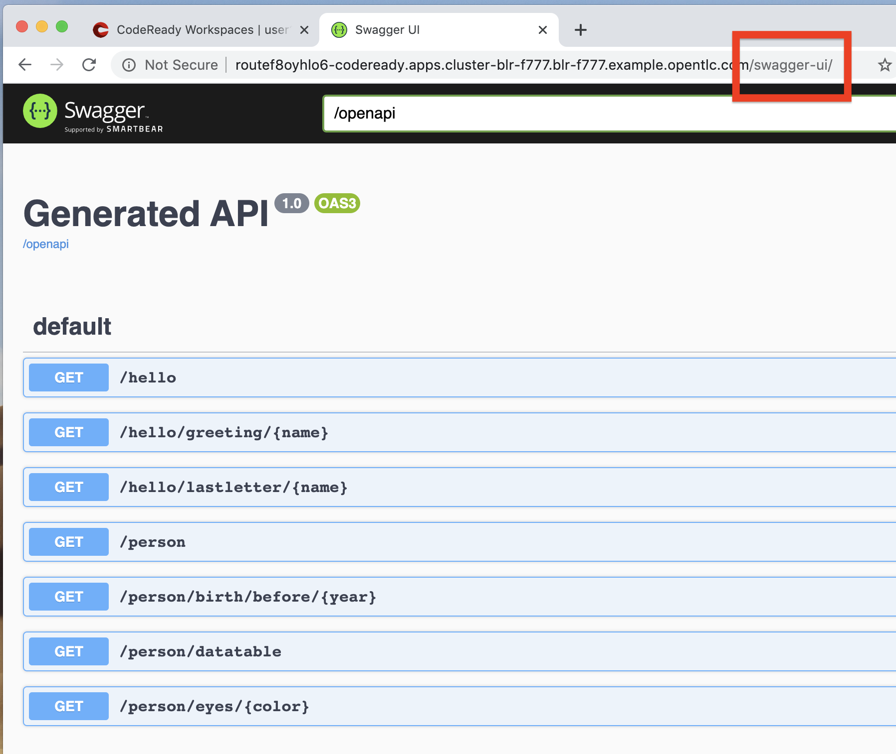
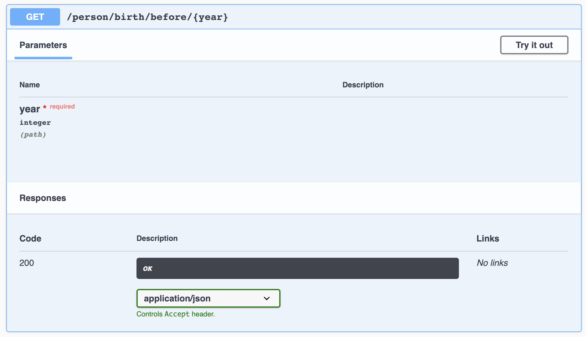
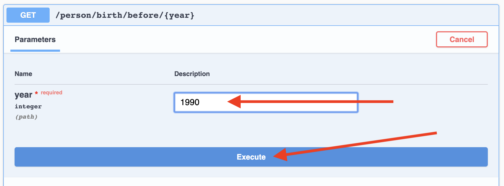
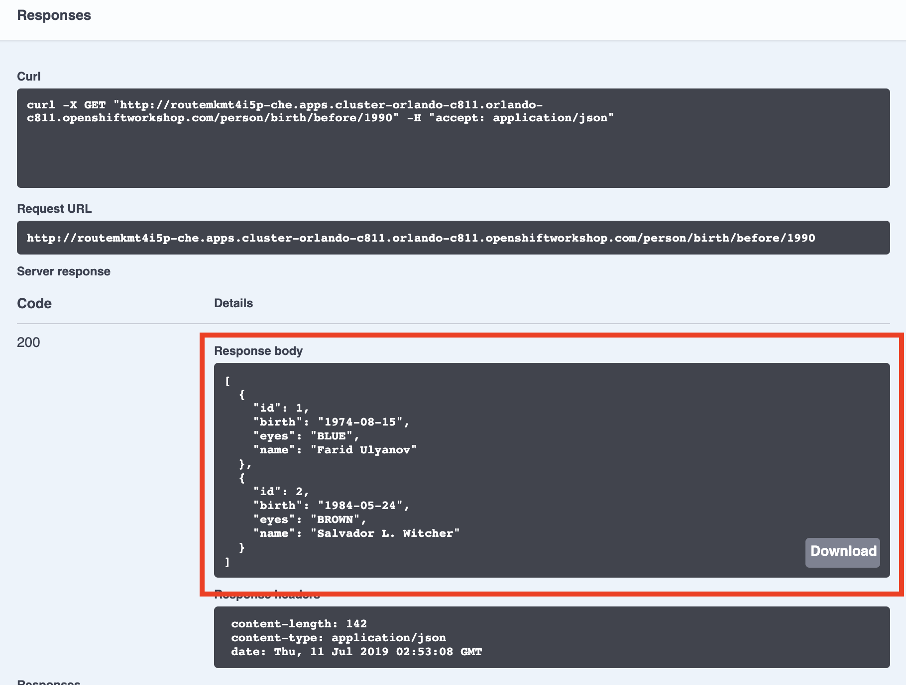
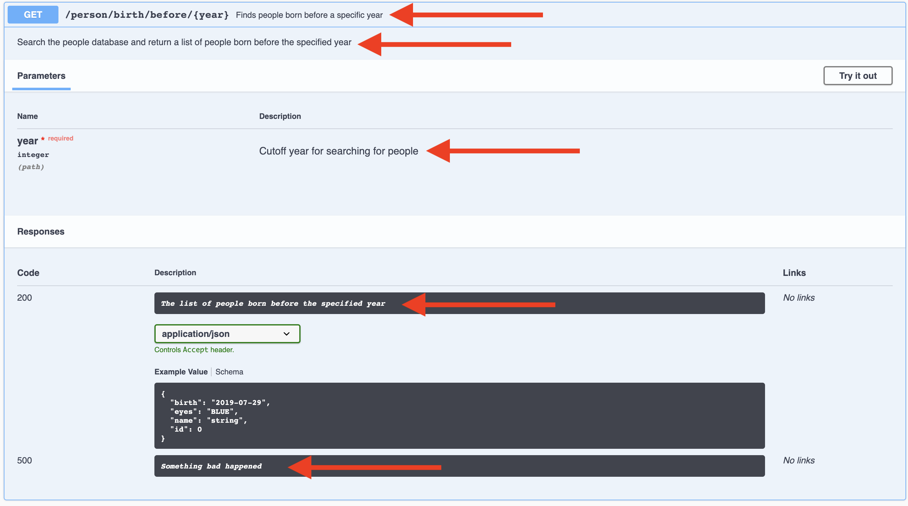

# Documenting and Testing APIs

Exposing APIs has become an essential part of all modern applications. At the center of this revolution known as the *API Economy* we find *RESTful* APIs, which can transform any application into language agnostic services that can be called from anywhere: on-premises, private cloud, public cloud, etc.

>This guide explains how your Quarkus application can expose its API description through an OpenAPI specification and how you can test it via a user-friendly UI named Swagger UI.
>
>An OpenAPI definition can then be used by documentation generation tools to display the API, code generation tools to generate servers and clients in various programming languages, testing tools, and many other use cases.
>
>Quarkus implements the MicroProfile Open API Specification and as such exposes several developer APIs for documenting your application’s APIs.
>
>The MicroProfile OpenAPI specification requires vendors to produce a valid OpenAPI document from pure JAX-RS 2.0 applications, without the developer adding any special annotations for OpenAPI. This means that vendors must process all the relevant JAX-RS annotations (such as `@Path` and `@Consumes`) as well as Java objects (POJOs) used as input or output to JAX-RS operations.
>
>Therefore you as a developer get a lot of functionality out of the box without doing anything. Let’s test this out.
>

## 1. Add Extension

We need to add another extension for OpenAPI. Run the following command:

```
mvn quarkus:add-extension -Dextensions="openapi" -f .
```
([^ execute](didact://?commandId=vscode.didact.sendNamedTerminalAString&text=curlTerm$$mvn%20quarkus:add-extension%20-Dextensions="openapi"%20-f%20.&completion=Run%20Quarkus%20add-extension%20command. "Opens a new terminal and sends the command above"){.didact})

This will add the necessary extension for using OpenAPI, and a graphical frontend extension called **Swagger** which we’ll discuss later. It also enables a new RESTful endpoint in the app accessible at `/openapi`.

Access the new endpoint using the following command in a Terminal:

```
curl http://localhost:8080/openapi
```
([^ execute](didact://?commandId=vscode.didact.sendNamedTerminalAString&text=curlTerm$$curl%20http://localhost:8080/openapi%20;%20echo%20''&completion=Run%20curl%20command. "Opens a new terminal and sends the command above"){.didact})

This endpoint was created as part of the Quarkus OpenAPI Extension, and emits a programmatic description of your current endpoints as yaml (or json):

```
paths:
  /hello:
    get:
      responses:
        200:
          description: OK
          content:
            text/plain:
              schema:
                type: string
  /hello/greeting/{name}:
    get:
      parameters:
      - name: name
        in: path
        required: true
        schema:
          type: string
      responses:
        200:
          description: OK
          content:
            text/plain:
              schema:
                type: string
# ... and the rest of your endpoints
```

>If you want JSON instead of YAML, use
>
>```
>curl -H "Accept: application/json" http://localhost:8080/openapi
>```

So out of the box all your endpoints are fully documented and will be emitted in a programmatic format from the `/openapi` endpoint. CLIs are great, but for quick testing of APIs, wouldn’t it be great if that programmatic API was turned into an interactive, forms-based web page for quickly trying out endpoints? That’s what *Swagger UI* does.

## 2. Access Swagger UI

When building APIs, developers want to test them quickly. Swagger UI is a great tool for visualizing and interacting with your APIs. The UI is automatically generated from your OpenAPI specification.

>By default, Swagger UI is only available when Quarkus is started in dev or test mode.
>
>If you want to make it available in production too, you can include the following configuration in your application.properties:
>
> `quarkus.swagger-ui.always-include=true`

Since our app is still running in dev mode, open the following url in browser:

open [localhost:8080/swagger-ui](http://localhost:8080/swagger-ui) in your browser. 

Then, add `/swagger-ui` to the end of the URL to access the Swagger UI and play with your API.



Using the UI, expand the `/personswagger/birth/before/{year}` endpoint. Here you can basic detail about the endpoint: the name of the endpoint, parameters and their type, and the response type one can expect.



Click the Try it out button to expand the box allowing you to try it. Enter the year 1990 in the box and click Execute:



This accesses the endpoint in the same way that curl does, and shows you the result (along with corresponding metadata in the HTTP response):



Pretty handy way to test out your APIs!

## 3. Documenting your APIs

OpenAPI and Swagger are useful tools but they become even more useful to 3rd party consumers of your API if you properly document them. With OpenAPI, you as a developer can add additional annotations right into the code to document them (which is a good practice anyway - when the code changes, the docs can too).

You as an application developer have a few choices in documenting your APIs:

- Augment your JAX-RS annotations with the OpenAPI Annotations. Using annotations means you don’t have to re-write the portions of the OpenAPI document that are already covered by the JAX-RS framework (e.g. the HTTP method of an operation).

- Take the initial output from `/openapi` as a starting point to document your APIs via Static OpenAPI files (and then check those into source code repositories and update when APIs change). It’s worth mentioning that these static files can also be written before any code, which is an approach often adopted by enterprises that want to lock-in the contract of the API. In this case, we refer to the OpenAPI document as the "source of truth", by which the client and provider must abide.

- Use the Programming model to provide a bootstrap (or complete) OpenAPI model tree.

Additionally, a Filter is described which can update the OpenAPI model after it has been built from the previously described documentation mechanisms.

So let’s add a bit more documentation to our `/person/birth/before/{year}` endpoint using the first option (annotations). Open the `PersonResource` class, and find the `getBeforeYear` method — this method implements our endpoint.

## 4. Add OpenAPI annotations

Add a few annotations: We created a copy of `PersonResource.java` and made `PersonResourceSwagger.java` ([open](didact://?commandId=vscode.openFolder&projectFilePath=src/main/java/org/acme/people/rest/PersonResourceSwagger.java&completion=Opened%20the%20PersonResourceSwagger.java%20file "Opens the PersonResourceSwagger.java file"){.didact}). Check the API implementation for the details below.

1. Add an `@Operation` annotation on the `getBeforeYear` method to provide a brief summary and description:

```
@Operation(summary = "Finds people born before a specific year",
           description = "Search the people database and return a list of people born before the specified year")
```

2. Add an `@ApiResponses` annotation below the `@Operation` that documents two of the possible HTTP return values ("200" and "500") to the method signature:

```
@APIResponses(value = {
    @APIResponse(responseCode = "200", description = "The list of people born before the specified year",
        content = @Content(
            schema = @Schema(implementation = Person.class)
        )),
    @APIResponse(responseCode = "500", description = "Something bad happened")
})
```

3. Add an additional bit of documentation before the existing `@PathParam` method parameter:

```
@Parameter(description = "Cutoff year for searching for people", required = true, name="year")
```

You can individually import the correct classes, but here are the imports you can add to the top of your class to fix the errors in the IDE:

```
import org.eclipse.microprofile.openapi.annotations.Operation;
import org.eclipse.microprofile.openapi.annotations.parameters.Parameter;
import org.eclipse.microprofile.openapi.annotations.responses.APIResponses;
import org.eclipse.microprofile.openapi.annotations.responses.APIResponse;
import org.eclipse.microprofile.openapi.annotations.media.Content;
import org.eclipse.microprofile.openapi.annotations.media.Schema;
```

The final method should look like:

```
@Operation(summary = "Finds people born before a specific year",
           description = "Search the people database and return a list of people born before the specified year")
@APIResponses(value = {
    @APIResponse(responseCode = "200", description = "The list of people born before the specified year",
        content = @Content(
            schema = @Schema(implementation = Person.class)
        )),
    @APIResponse(responseCode = "500", description = "Something bad happened")
})
@GET
@Path("/birth/before/{year}")
@Produces(MediaType.APPLICATION_JSON)
public List<Person> getBeforeYear(
    @Parameter(description = "Cutoff year for searching for people", required = true, name="year")
    @PathParam(value = "year") int year) {

    return Person.getBeforeYear(year);
}
```

Now reload the same Swagger UI webpage (and expand the `/personswagger/birth/before/{year}` section). Notice the Swagger documention is more filled out for the endpoint to which we added extra OpenAPI documentation:



## 5. Congratulations
In this exercise you learned more about the MicroProfile OpenAPI specification and how to use it to do in-place documentation of your RESTful microservice APIs.

There are additional types of documentation you can add, for example you can declare the security features and requirements of your API and then use these where appropriate in your paths and operations.