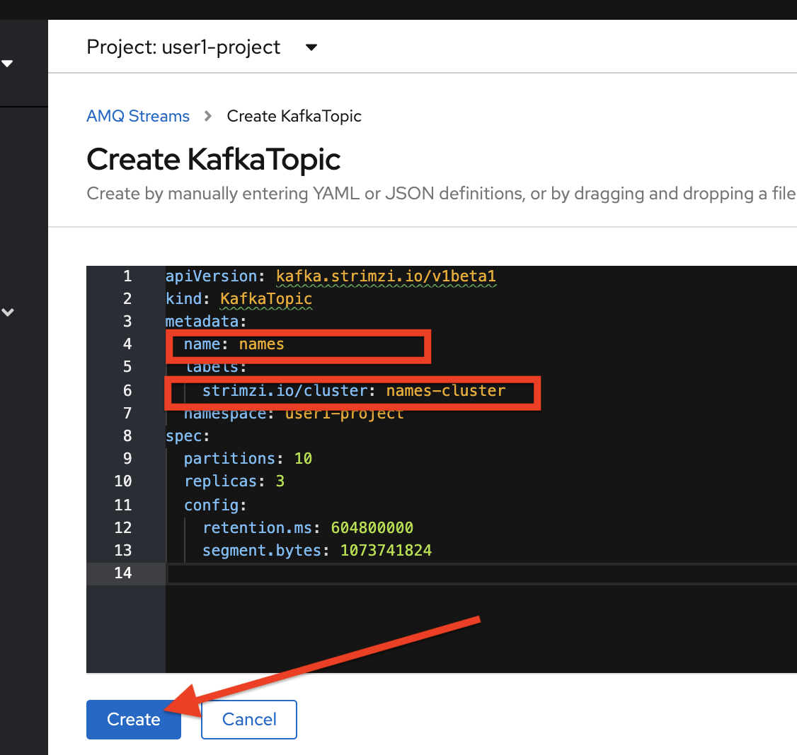
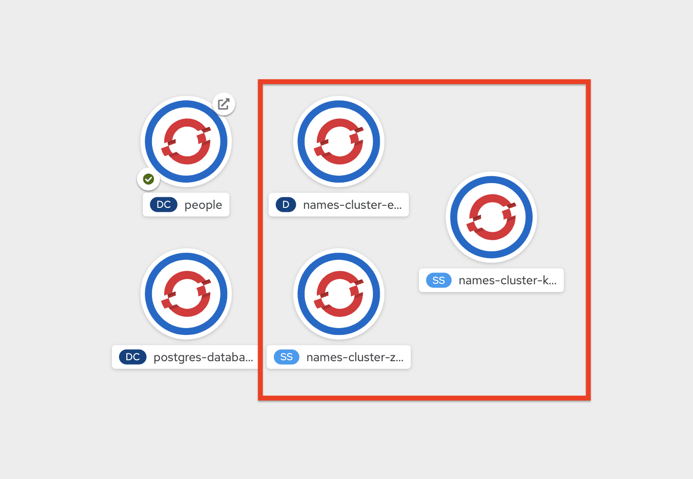

# Streaming Data with Quarkus and Kafka

In this exercise, you will use the Quarkus Kafka extension to build a streaming application using MicroProfile Reactive Streams Messaging and `Apache Kafka`, a distributed streaming platform. You will also use `Strimzi`, which provides an easy way to run an Apache Kafka cluster on Kubernetes using `Operators`.

## 1. What is Apache Kafka?

Apache Kafka is a distributed streaming platform. A streaming platform has three key capabilities:

- Publish and subscribe to streams of records, similar to a message queue or enterprise messaging system.

- Store streams of records in a fault-tolerant durable way.

- Process streams of records as they occur.

- Kafka is generally used for two broad classes of applications:

- Building real-time streaming data pipelines that reliably get data between systems or applications

- Building real-time streaming applications that transform or react to the streams of data

## 2. What is Strimzi?

Strimzi provides a way to run an Apache Kafka cluster on Kubernetes in various deployment configurations.

Strimzi is based on Apache Kafka, and makes it easy to run Apache Kafka on OpenShift or Kubernetes.

Strimzi provides three operators:

- **Cluster Operator** - Responsible for deploying and managing Apache Kafka clusters within an OpenShift or Kubernetes cluster.

- **Topic Operator** - Responsible for managing Kafka topics within a Kafka cluster running within an OpenShift or Kubernetes cluster.

- **User Operator** - Responsible for managing Kafka users within a Kafka cluster running within an OpenShift or Kubernetes cluster.

## 3. The Goal

In this exercise, we are going to generate (random) names in one component. These names are written in a Kafka topic (`names`). A second component reads from the `names` Kafka topic and applies some magic conversion to the name (adding an honorific). The result is sent to an in-memory stream consumed by a JAX-RS resource. The data is sent to a browser using `server-sent events` and displayed in the browser. It will look like this:

## 4. Create Kafka Cluster

The Strimzi operator installs and manages Kafka clusters on Kubernetes. You can go to "Operator Hub" and install the AMQ-Streams operator very easily. 
Open [the AMQ-Streams blog](https://middlewareblog.redhat.com/2019/12/10/getting-started-with-the-red-hat-amq-streams-operator/) in your browser. 

First, on the OpenShift Developer view, click **+Add** and, then From Catalog:


Type in `kafka` in the keyword filter box:


These are all of the Kafka cluster elements you can install. Click on **Kafka**, and then click on **Create**. This will open a yaml file for you to configure the cluster before it’s installed. Change the name of the cluster from `my-cluster` to `names-cluster` (under the metadata section of the YAML file). Leave all other values as-is, and click **Create**:


This will create a new Kafka Kubernetes object in your namespace, triggering the Operator to deploy Kafka.

## 5. Create Kafka Topic

Follow the same process to create a Kafka Topic:

Click **+Add** on the left again, select **From Catalog**, and enter `topic` into the search box. Click on the *Kafka Topic* box, then click **Create**:


We’ll need to create a topic for our application to stream to and from, so in the YAML:

- Change the metadata > name value from `my-topic` to `names`.

- Change the vale of the `strimzi.io/cluster` label from `my-cluster` to `names-cluster`

Then click **Create**.



This will cause the Operator to provision a new Topic in the Kafka cluster.

Back on the OpenShift console, Developer view, make sure all the Kafka and Zookeeper pods are up and running (with dark blue circles):



It may take a few minutes for all of the pods to appear spin up. You can continue to the next step while the Kafka cluster and topics are created.

## 6. Add Quarkus Kafka Extension

With Kafka installing, turn your attention back to the app. Like other exercises, we’ll need another extension to integrate with Kafka. Install it with:

```
mvn quarkus:add-extension -Dextensions="kafka" -f $CHE_PROJECTS_ROOT/quarkus-workshop-labs
```
([^ execute](didact://?commandId=vscode.didact.sendNamedTerminalAString&text=curlTerm$$mvn%20quarkus:add-extension%20-Dextensions="kafka"%20-f%20.&completion=Run%20Quarkus%20add-extension%20command. "Opens a new terminal and sends the command above"){.didact})

This will add the necessary entries in your `pom.xml` to bring in the Kafka extension.

## 7. The Application You Will Build

The app consists of 3 components that pass messages via Kafka and an in-memory stream, then uses SSE to push messages to the browser. It looks like:


## 8. Create name generator
To start building the app, create a new Java class file in the `org.acme.people.stream` called `NameGenerator.java` ([open](didact://?commandId=vscode.openFolder&projectFilePath=src/main/java/org/acme/people/stream/NameGenerator.java&completion=Opened%20the%20NameGenerator.java%20file "Opens the NameGenerator.java file"){.didact}). This class will generate random names and publish them to our Kafka topic for further processing. 

The method returns a Reactive Stream. The generated items are sent to the stream named `generated-name`. This stream is mapped to Kafka using the `application.properties`  ([open](didact://?commandId=vscode.openFolder&projectFilePath=src/main/resources/application.properties&completion=Opened%20the%20application.properties%20file "Opens the application.properties file"){.didact})file that we will create soon.

## 9. Add honorifics

The name converter reads the names from Kafka, and transforms them, adding a random (English) honorific to the beginning of the name.

Create a new Java class file in the same package called `NameConverter.java` ([open](didact://?commandId=vscode.openFolder&projectFilePath=src/main/java/org/acme/people/stream/NameConverter.java&completion=Opened%20the%20NameConverter.java%20file "Opens the NameConverter.java file"){.didact}). 

The process method is called for every *Kafka* record from the `names` topic (configured in the application.properties configuration ([open](didact://?commandId=vscode.openFolder&projectFilePath=src/main/resources/application.properties&completion=Opened%20the%20application.properties%20file "Opens the application.properties file"){.didact})). Every result is sent to the my-data-stream in-memory stream.

## 10. Expose to front end

Finally, let’s bind our stream to a JAX-RS resource. Create a new Java class in the same package called `NameResource.java`([open](didact://?commandId=vscode.openFolder&projectFilePath=src/main/java/org/acme/people/stream/NameResource.java&completion=Opened%20the%20NameResource.java%20file "Opens the NameResource.java file"){.didact}). 


>There is a pre-created `names.html` page for you to use (in the `src/main/resources/META-INF/resources` directory) which will make a request to this `/names/stream` endpoint using standard JavaScript running in the browser and draw the resulting names using the D3.js library. The JavaScript that makes this call looks like this (do not copy this into anything!):
>```
>var source = new EventSource("/names/stream"); 
>
>source.onmessage = function (event) { 
>
>    console.log("received new name: " + event.data);
>    // process new name in event.data
>    // ...
>
>    // update the display with the new name
>    update(); 
>};
>```

- Uses your browser’s support for the `EventSource` API (part of the W3C SSE standard) to call the endpoint
- Each time a message is received via SSE, react to it by running this function
- Refresh the display using the D3.js library

## 11. Configure application

We need to configure the Kafka connector. This is done in the `application.properties` ([open](didact://?commandId=vscode.openFolder&projectFilePath=src/main/resources/application.properties&completion=Opened%20the%20application.properties%20file "Opens the application.properties file"){.didact})) file (in the `src/main/resources` directory). The keys are structured as follows:

`mp.messaging.[outgoing|incoming].{channel-name}.property=value`

The `channel-name` segment must match the value set in the `@Incoming` and `@Outgoing` annotation:

- `generated-name` → sink to which we write the names

- `names` → source from which we read the names

Check the following values in `src/main/resources/application.properties` ([open](didact://?commandId=vscode.openFolder&projectFilePath=src/main/resources/application.properties&completion=Opened%20the%20application.properties%20file "Opens the application.properties file"){.didact})):

```
# Configure the Kafka sink (we write to it)
%prod.mp.messaging.outgoing.generated-name.bootstrap.servers=names-cluster-kafka-bootstrap:9092
%prod.mp.messaging.outgoing.generated-name.connector=smallrye-kafka
%prod.mp.messaging.outgoing.generated-name.topic=names
%prod.mp.messaging.outgoing.generated-name.value.serializer=org.apache.kafka.common.serialization.StringSerializer

# Configure the Kafka source (we read from it)
%prod.mp.messaging.incoming.names.bootstrap.servers=names-cluster-kafka-bootstrap:9092
%prod.mp.messaging.incoming.names.connector=smallrye-kafka
%prod.mp.messaging.incoming.names.value.deserializer=org.apache.kafka.common.serialization.StringDeserializer
```

> The hostnames you see here will only make sense (be resolvable via DNS) when this app is run in the same Kubernetes namespace as the Kafka cluster you created earlier. So you’ll see this and other config values above prefixed with `%prod` which will not try to initialize Kafka when in `dev` mode.
> What about `my-data-stream`? This is an in-memory stream, not connected to a message broker.

## 12. Rebuild Executable JAR

```
mvn -DskipTests clean package -Pnative -Dquarkus.native.container-build=true
```

([^ execute](didact://?commandId=vscode.didact.sendNamedTerminalAString&text=QNativeTerm$$mvn%20-Dskiptests%20clean%20package%20-Pnative%20-Dquarkus.native.container-build=true&completion=Run%20Quarkus%20native%20mode. "Opens a new terminal and sends the command above"){.didact})

You should see a bunch of log output that ends with a `SUCCESS` message.

## 13. Deploy to OpenShift

And now start the build using our executable JAR:

```
oc start-build people --from-file target/*-runner.jar --follow
```
([^ execute](didact://?commandId=vscode.didact.sendNamedTerminalAString&text=ocTerm$$oc%20start-build%20people%20--from-file%20target/*-runner%20--follow&completion=Run%20oc%20start-build%20command. "Opens a new terminal and sends the command above"){.didact})

The build should take a minute or two to complete.

## 14. Test

Our application should be up and running in a few seconds after the build completes and generating names. To see if it’s working, access the page `names.html`. You should see a cloud of names updating every 5 seconds (it may take a few seconds for it to start!):

Run the command
```
oc get route people -o=go-template --template='{{ .spec.host }}'/names.html ; echo ''
```
Open the URL in browser.

> It takes a few seconds to establish the connection to Kafka. If you don’t see new names generated every 5 seconds, reload the browser page to re-initialize the SSE stream.

These are the original names streamed through Kafka, altered to add a random honorific like "Sir" or "Madam", and displayed in a "word cloud" for you to enjoy!

## 15. Congratulations!

This guide has shown how you can interact with Kafka using Quarkus. It utilizes MicroProfile Reactive Messaging to build data streaming applications.

If you want to go further check the documentation of SmallRye Reactive Messaging, the implementation used in Quarkus.