# Monitoring with Prometheus and Grafana

This exercise demonstrates how your Quarkus application can utilize the MicroProfile Metrics specification through the SmallRye Metrics extension.

>MicroProfile Metrics allows applications to gather various metrics and statistics that provide insights into what is happening inside the application. They eye serve to pinpoint issues, provide long term trend data for capacity planning and pro-active discovery of issues (e.g. disk usage growing without bounds). Metrics can also help those scheduling systems decide when to scale the application to run on more or fewer machines.
>
>The metrics can be read remotely using JSON format or the OpenMetrics text format, so that they can be processed by additional tools such as Prometheus, and stored for analysis and visualisation. You can then use tools like Prometheus and Grafana to collect and display metrics for your Quarkus apps.

## 1. Install Prometheus

First, let’s install Prometheus on OpenShift. Prometheus is an open-source systems monitoring and alerting toolkit featuring:

- a multi-dimensional data model with time series data identified by metric name and key/value pairs

- PromQL, a flexible query language to leverage this dimensionality

- time series collection happens via a pull model over HTTP

To install it, first create a Kubernetes ConfigMap that will hold the Prometheus configuration. In the Terminal, run the following:

```
oc create configmap prom --from-file=prometheus.yml=src/main/kubernetes/prometheus.yml
```
([^ execute](didact://?commandId=vscode.didact.sendNamedTerminalAString&text=ocTerm$$oc%20create%20configmap%20prom%20--from-file=prometheus.yml=src/main/kubernetes/prometheus.yml%20&completion=oc%20create "Opens a new terminal and sends the command above"){.didact})

This will create a ConfigMap using the contents of the `src/main/kubernetes/prometheus.yml` ([open](didact://?commandId=vscode.openFolder&projectFilePath=src/main/kubernetes/prometheus.yml&completion=Opened%20the%20prometheus.yml%20file "Opens the prometheus.yml file"){.didact}) file in your project. It contains basic Prometheus configuration, plus a specific target which instructs it to look for application metrics from both Prometheus itself, and our `people` app, on HTTP port `8080` at the `/metrics` endpoint. Here’s a snippet of that file:

```
scrape_configs:
  - job_name: 'prometheus' 
    static_configs:
    - targets: ['localhost:9090']

  - job_name: 'people_app' 
    static_configs:
    - targets: ['people:8080']
```

- Configures Prometheus to scrape metrics from itself
- Configures Prometheus to scrape metrics from Kubernetes service `people` on port `8080` with HTTP, at the default metrics endpoint of `/metrics`

## 2. Deploy Prometheus from Container Image

On the OpenShift console, Developer View, click on **+Add**, and choose "Container Image"

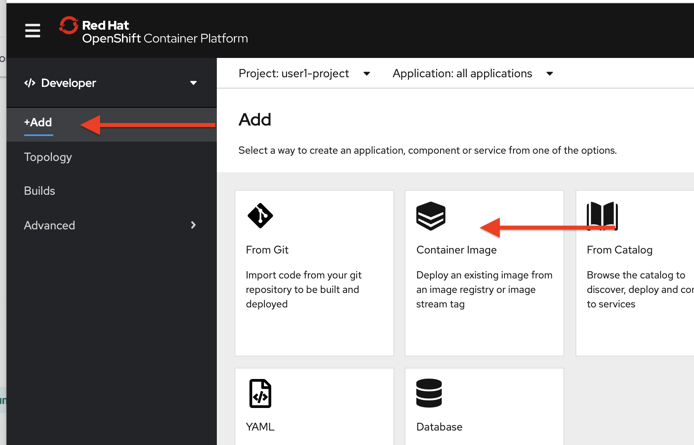

Fill out the following fields:

- **Image Name**: `prom/prometheus`

- **Application Name**: `prometheus`

- **Name**: `prometheus`

Click the "Magnifying Glass" search icon next to the image name to confirm the image exists.

Leave the rest as-is and click **Create**:

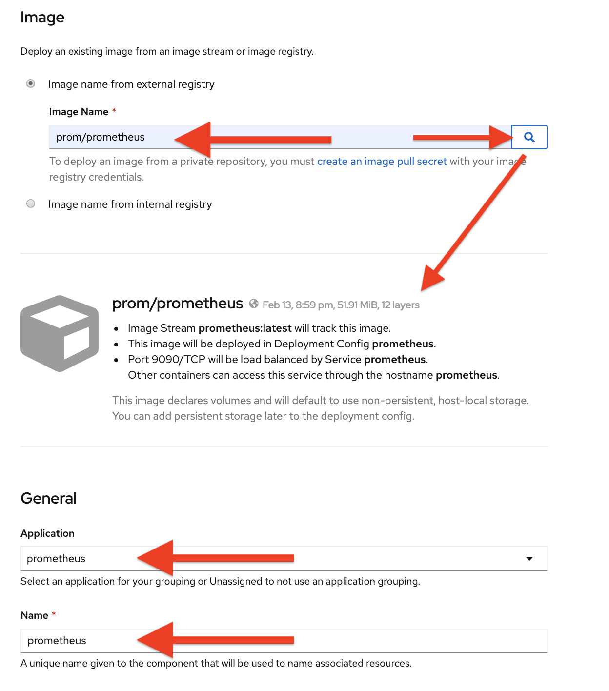


On the Toplogy view, you’ll see prometheus spinning up.

Finally, mount the ConfigMap into the running container:

```
oc set volume deployment/prometheus --add -t configmap --configmap-name=prom -m /etc/prometheus/prometheus.yml --sub-path=prometheus.yml
```
([^ execute](didact://?commandId=vscode.didact.sendNamedTerminalAString&text=ocTerm$$oc%20set%20volume%20deployment/prometheus%20--add%20-t%20configmap%20--configmap-name=prom%20-m%20/etc/prometheus/prometheus.yml%20--sub-path=prometheus.yml&completion=oc%20set%20command "Opens a new terminal and sends the command above"){.didact})

You should get `deployment.extensions/prometheus volume updated` and this will cause the contents of the ConfigMap’s `prometheus.yml` data to be mounted at `/etc/prometheus/prometheus.yml` where Prometheus is expecting it, and it will start scraping metrics from our app. But our app does not yet expose metrics. We’ll do that in the next step.

Verify Prometheus is up and running:

```
oc rollout status -w deployment/prometheus
```
([^ execute](didact://?commandId=vscode.didact.sendNamedTerminalAString&text=ocTerm$$oc%20rollout%20status%20deployment/prometheus&completion=oc%20rollout%20command "Opens a new terminal and sends the command above"){.didact})

You should see `replication controller "prometheus-2" successfully rolled out`.

Once it completes, click on the arrow to access the prometheus query UI:

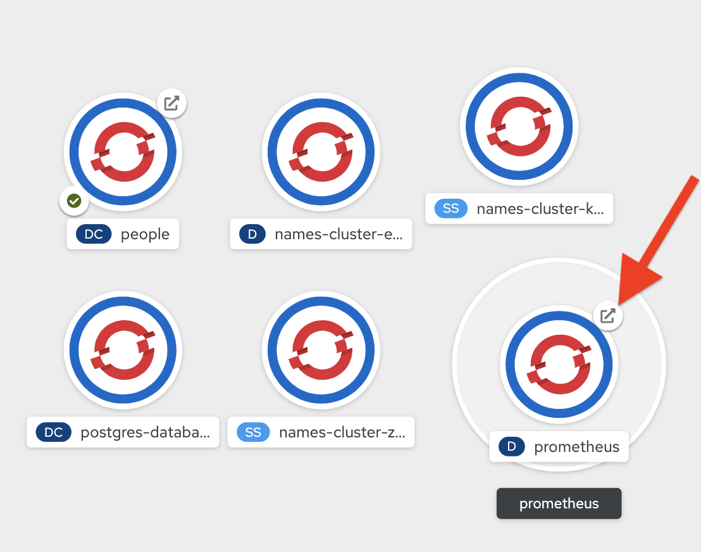

Which should load the Prometheus Web UI (we’ll use this later):

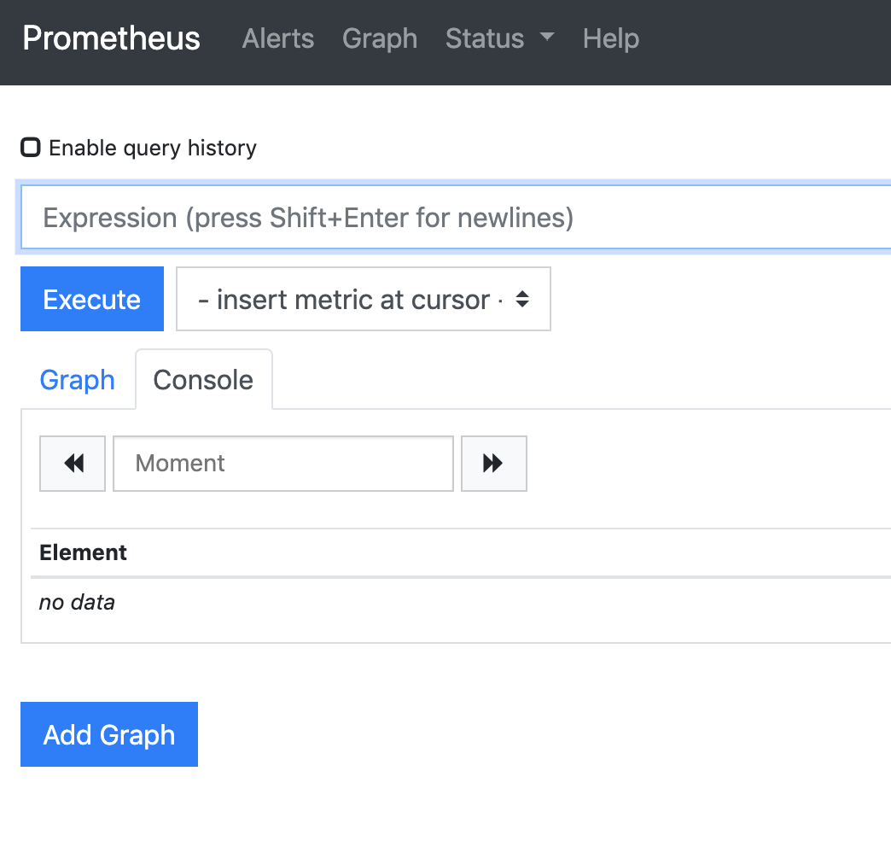

## 3. Add Metrics to Quarkus

Like other exercises, we’ll need another extension to enable metrics. Install it with:

```
mvn quarkus:add-extension -Dextensions="metrics" -f .
```
([^ execute](didact://?commandId=vscode.didact.sendNamedTerminalAString&text=curlTerm$$mvn%20quarkus:add-extension%20-Dextensions="metrics"%20-f%20.&completion=mvn%20quarkus:add-extension "Opens a new terminal and sends the command above"){.didact})

This will add the necessary entries in your pom.xml to bring in the Metrics capability. It will import the smallrye-metrics extension which is an implementation of the MicroProfile Metrics specification used in Quarkus.

## 4. Test Metrics endpoint

You will be able to immediately see the raw metrics generated from Quarkus apps. Run this in the Terminal:

```
curl http://localhost:8080/metrics
```
([^ execute](didact://?commandId=vscode.didact.sendNamedTerminalAString&text=curlTerm$$curl%20http://localhost:8080/metrics&completion=curl%20command%20completed "Opens a new terminal and sends the command above"){.didact})

You will see a bunch of metrics in the OpenMetrics format:

```
# HELP base:jvm_uptime_seconds Displays the time from the start of the Java virtual machine in milliseconds.
# TYPE base:jvm_uptime_seconds gauge
base:jvm_uptime_seconds 5.631
# HELP base:gc_ps_mark_sweep_count Displays the total number of collections that have occurred. This attribute lists -1 if the collection count is undefined for this collector.
# TYPE base:gc_ps_mark_sweep_count counter
base:gc_ps_mark_sweep_count 2.0
```

This is what Prometheus will use to access and index the metrics from our app when we deploy it to the cluster.

## 5. Add additional metrics

Out of the box, you get a lot of basic JVM metrics which are useful, but what if you wanted to provide metrics for your app? Let’s add a few using the MicroProfile Metrics APIs.

Open the `GreetingService` class ([open](didact://?commandId=vscode.openFolder&projectFilePath=src/main/java/org/acme/people/service/GreetingService.java&completion=Opened%20the%20GreetingService.java%20file "Opens the GreetingService.java file"){.didact}). Let’s add a metric to count the number of times we’ve greeted someone. Observe the following annotation to the `greeting()` method:

```
@Counted(name = "greetings", description = "How many greetings we've given.")
```

Also, note that the necessary import statement at the top of the file:
```
import org.eclipse.microprofile.metrics.annotation.Counted;
```

Next, trigger a greeting:

```
curl http://localhost:8080/hello/greeting/quarkus
```
([^ execute](didact://?commandId=vscode.didact.sendNamedTerminalAString&text=curlTerm$$curl%20http://localhost:8080/hello/greeting/quarkus&completion=curl%20command%20completed "Opens a new terminal and sends the command above"){.didact})


And then access the metrics again, this time we’ll look for our new metric, specifying a scope of application in the URL so that only metrics in that scope are returned:

```
curl http://localhost:8080/metrics/application
```
([^ execute](didact://?commandId=vscode.didact.sendNamedTerminalAString&text=curlTerm$$curl%20http://localhost:8080/metrics/application&completion=curl%20command%20completed "Opens a new terminal and sends the command above"){.didact})

You’ll see:

```
# HELP application_org_acme_people_rest_GreetingResource_greetings_total How many greetings we've given.
# TYPE application_org_acme_people_rest_GreetingResource_greetings_total counter
application_org_acme_people_rest_GreetingResource_greetings_total 1.0
```

This shows we’ve accessed the greetings once (`1.0`). Repeat the `curl` greeting a few times and then access metrics again, and you’ll see the number rise.

>The comments in the metrics output starting with # are part of the format and give human-readable descriptions to the metrics which you’ll see later on.
>
>In the OpenMicroProfile Metrics names are prefixed with things like `vendor:` or `application:` or `base:`. These scopes can be selectively accessed by adding the name to the accessed endpoint, e.g. `curl http://localhost:8080/metrics/application` or `curl http://localhost:8080/metrics/base`.

## 6. Add a few more

Let’s do a few more metrics for our Kafka stream we setup in the previous exercise. Open the `NameConverter` class ([open](didact://?commandId=vscode.openFolder&projectFilePath=src/main/java/org/acme/people/stream/NameConverter.java&completion=Opened%20the%20NameConverter.java%20file "Opens the NameConverter.java file"){.didact}), and observe these metrics annotations to the `process()` method:

```
@Counted(name = "convertedNames", description = "How many names have been converted.") 
@Timed(name = "converter", description = "A measure how long it takes to convert names.", unit = MetricUnits.MILLISECONDS) 
```

- First metric will count the number of times this method is called
- Second metric will measure how long it takes the method to run

Access the app once more to confirm you’ve got it all correct:

```
curl http://localhost:8080/metrics/application
```
([^ execute](didact://?commandId=vscode.didact.sendNamedTerminalAString&text=curlTerm$$curl%20http://localhost:8080/metrics/application&completion=curl%20command%20completed "Opens a new terminal and sends the command above"){.didact})

You’ll get many more metrics this time which we’ll explore soon.

## 7. Rebuild Executable JAR

Now we are ready to run our application on the cluster and look at the generated metrics

```
mvn -DskipTests clean package -Pnative -Dquarkus.native.container-build=true
```

([^ execute](didact://?commandId=vscode.didact.sendNamedTerminalAString&text=QNativeTerm$$mvn%20-Dskiptests%20clean%20package%20-Pnative%20-Dquarkus.native.container-build=true&completion=Run%20Quarkus%20native%20mode. "Opens a new terminal and sends the command above"){.didact})

## 8. Deploy to OpenShift

Let’s deploy our app to the cluster and see if Prometheus picks up our metrics! To do this, start the container build using our executable JAR:

```
oc start-build people --from-file target/*-runner.jar --follow
```
([^ execute](didact://?commandId=vscode.didact.sendNamedTerminalAString&text=ocTerm$$oc%20start-build%20people%20--from-file%20target/*-runner%20--follow&completion=Run%20oc%20start-build%20command. "Opens a new terminal and sends the command above"){.didact})

This will re-build the image by starting with the OpenJDK base image, adding in our executable JAR, and packaging the result as a container image on the internal registry. Wait for the build to finish.


## 9. Confirm deployment

The rebuild will also trigger a re-deployment of our app. 

You’ll see in the Topology view that the app is re-deployed with the new settings and the old app will be terminated soon after:


You should see a bunch of log output that ends with a SUCCESS message.

Run the command
```
oc rollout status -w dc/people
```
([^ execute](didact://?commandId=vscode.didact.sendNamedTerminalAString&text=ocTerm$$oc%20rollout%20status%20-w%20dc/people&completion=oc%20rollout%20command "Opens a new terminal and sends the command above"){.didact})

## 10. Test

You’ll need to trigger the methods that we’ve instrumented, let's open names.html again.

Our application should be up and running in a few seconds after the build completes and generating names. You should see a cloud of names updating every 5 seconds (it may take a few seconds for it to start!):

Run the command
```
oc get route people -o=go-template --template='{{ .spec.host }}'/names.html ; echo ''
```
Open the URL in browser.

> It takes a few seconds to establish the connection to Kafka. If you don’t see new names generated every 5 seconds, reload the browser page to re-initialize the SSE stream.


Within about 15-30 seconds, Prometheus should start scraping the metrics. In the Prometheus UI, Start typing in the query box to look for 'acme':

>If you do not see any acme metrics when querying, wait 15 seconds, reload the Prometheus page, and try again. They will eventually show up!

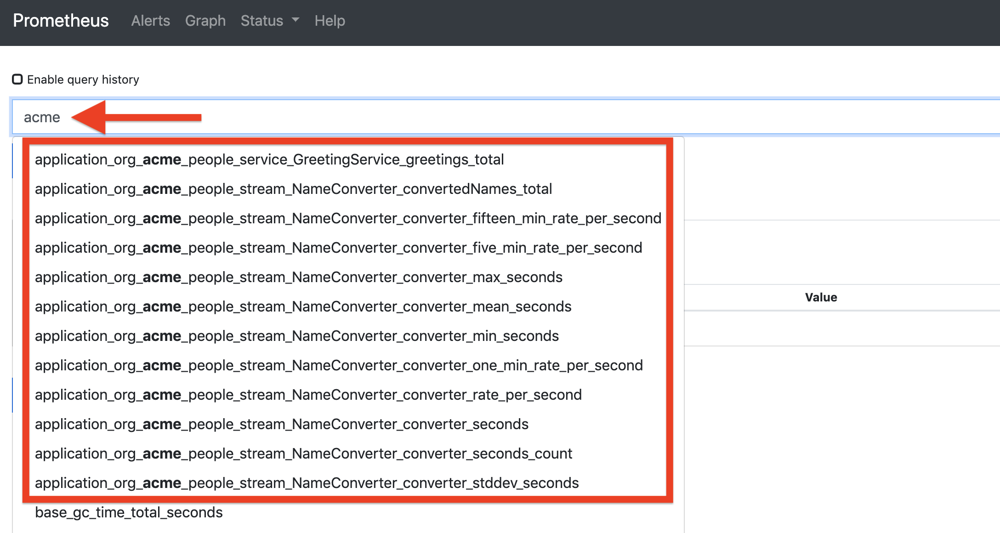

These are the metrics exposed by our application, both raw numbers (like number of converted names in the `application_org_acme_people_stream_NameConverter_convertedNames_total` metric) along with quantiles of the same data across different time periods (e.g. `application_org_acme_people_stream_NameConverter_converter_rate_per_second`).

Select `application_org_acme_people_stream_NameConverter_convertedNames_total` in the box, and click **Execute**. This will fetch the values from our metric showing the number of converted names:

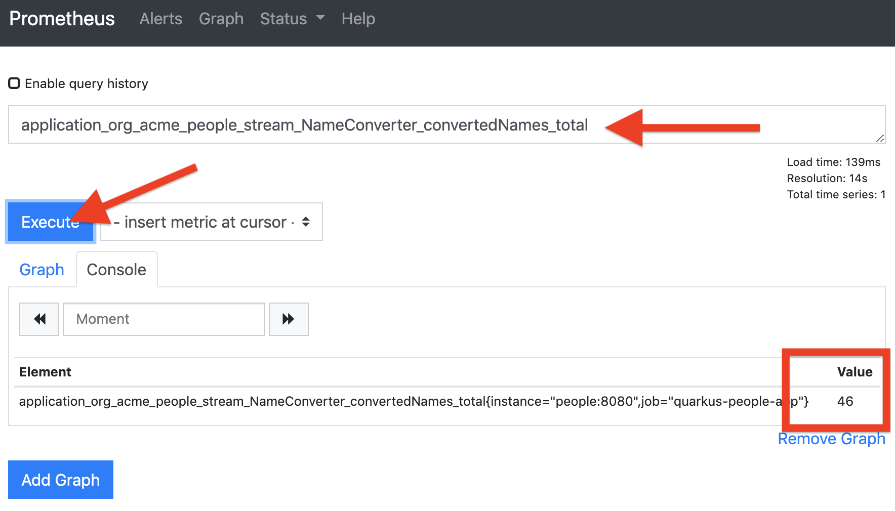

Click the Graph tab to see it visually, and adjust the time period to `5m`:

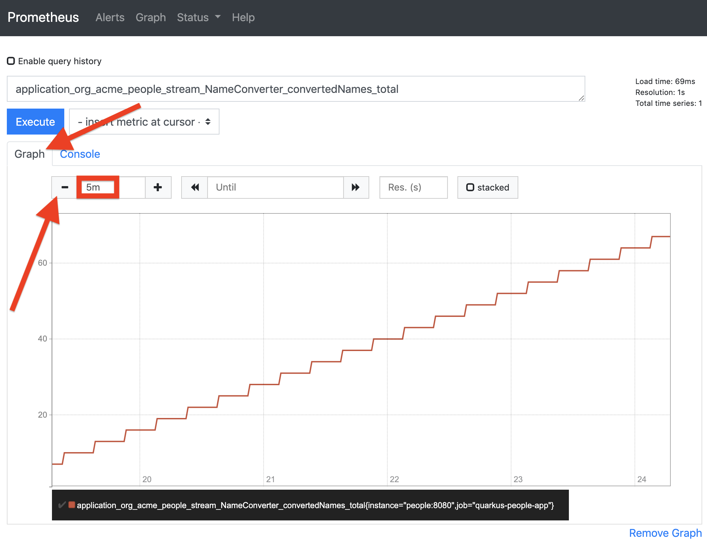

Cool! You can try this with some of the JVM metrics as well, e.g. try to graph the `process_resident_memory_bytes` to see how much memory our app is using over time:

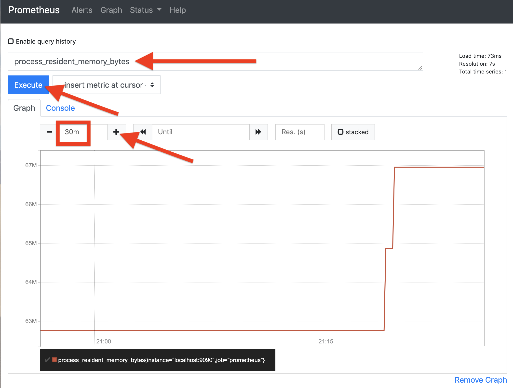

Of course Quarkus apps use very little memory, even for apps stuffed with all sorts of extensions and code.

## 11. Visualizing with Grafana

Grafana is commonly used to visualize metrics and provides a flexible, graphical frontend which has support for Prometheus (and many other data sources) and can display customized, realtime dashboards:

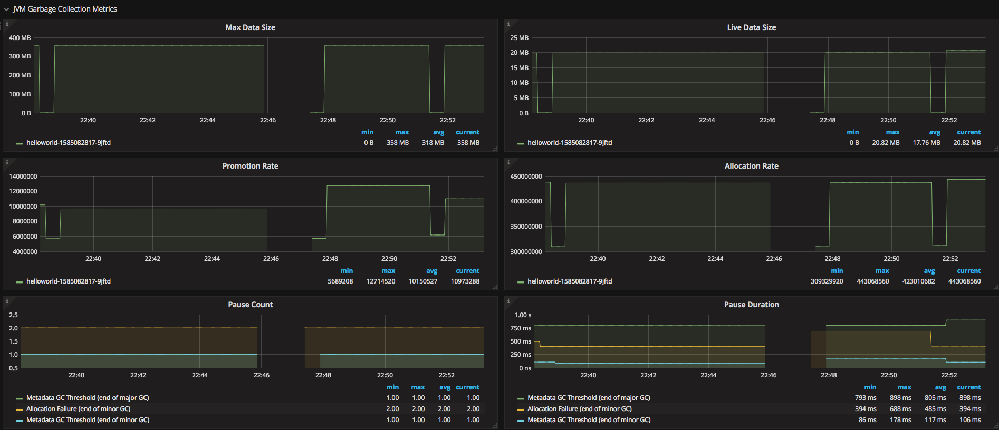

Let’s create a Grafana Dashboard for our Quarkus App!

## 12. Install Grafana

Follow the same process as before: On the OpenShift UI, Developer View, click on **+Add**, and choose "Container Image", and fill in the fields:

- Image Name: `grafana/grafana` (and then click the magnifying glass)

- Application: `Create Application`

- Application Name: `grafana`

- Name: `grafana`

Leave the rest as-is and click **Create**:

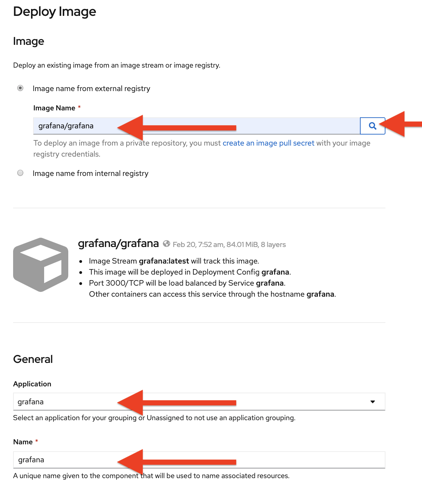

On the OpenShift UI, Developer View for your project, you’ll see Grafana spinning up. Once it completes, click on the arrow to access the Grafana UI:

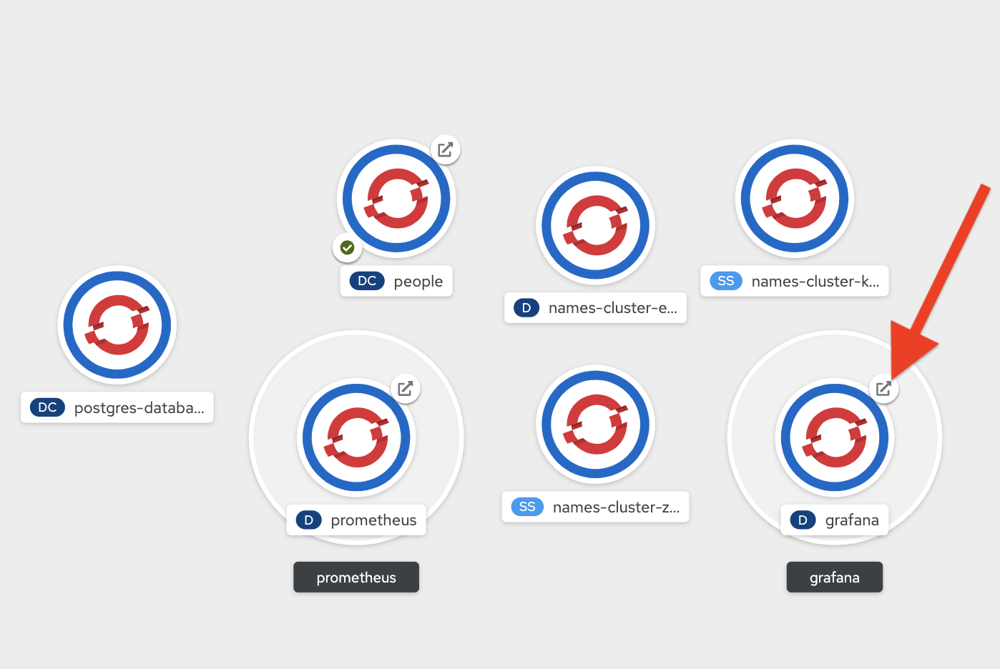

Which should load the Grafana Web UI:

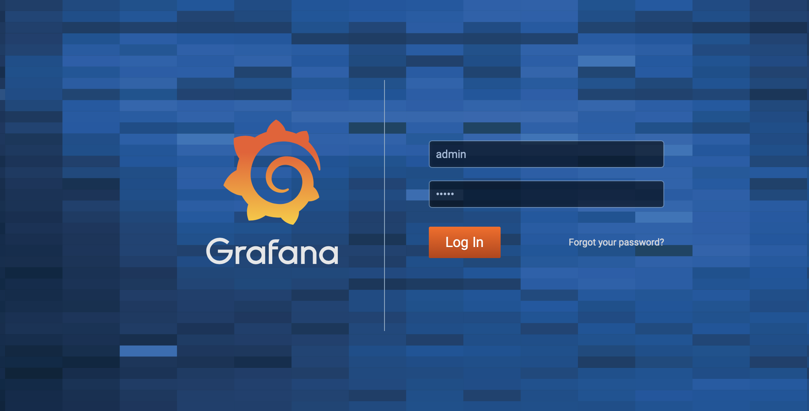

Log into Grafana web UI using the following values:

- Username: admin

- Password: admin

> Skip the Change Password (or change it to something else that you can remember)

You will see the landing page of Grafana as shown:

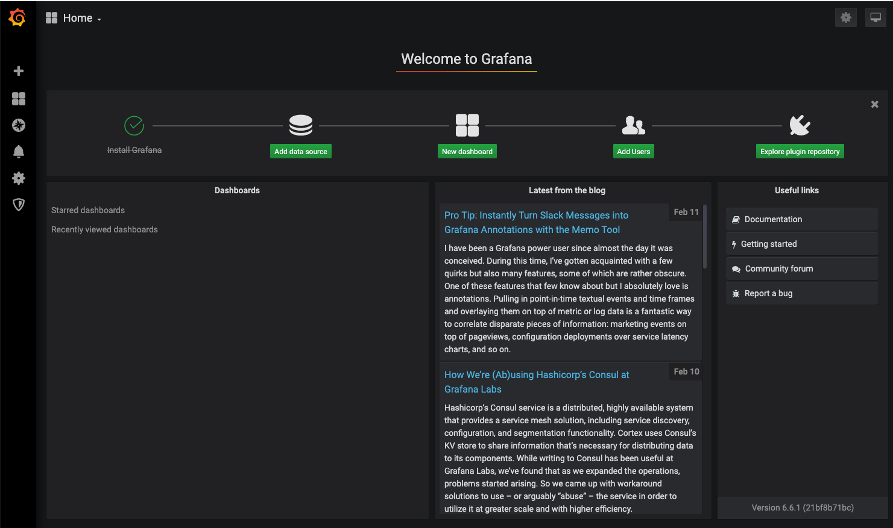

## 13. Add a data source to Grafana

Click Add data source and select **Prometheus** as data source type.

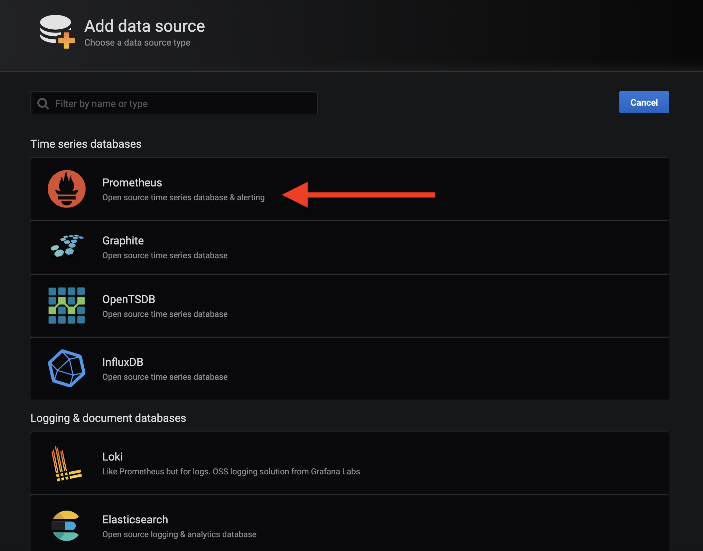

Fill out the form with the following values:

URL: prometheus-url:9090

Click on **Save & Test** and confirm you get a success message:


At this point Granana is set up to pull collected metrics from Prometheus as they are collected from the application(s) you are monitoring.

With our prometheus data source working, let’s make a dashboard.

## 14. Create Dashboard

Hover over the `+` button on the left, and select *Create > Dashboard*:

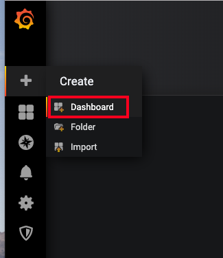


This will create a new dashboard with a single Panel. Each Panel can visualize a computed metric (either a single metric, or a more complex query) and display the results in the Panel.

Click **Add Query**. In the Query box, type acme to again get an autocompleted list of available metrics from our app:

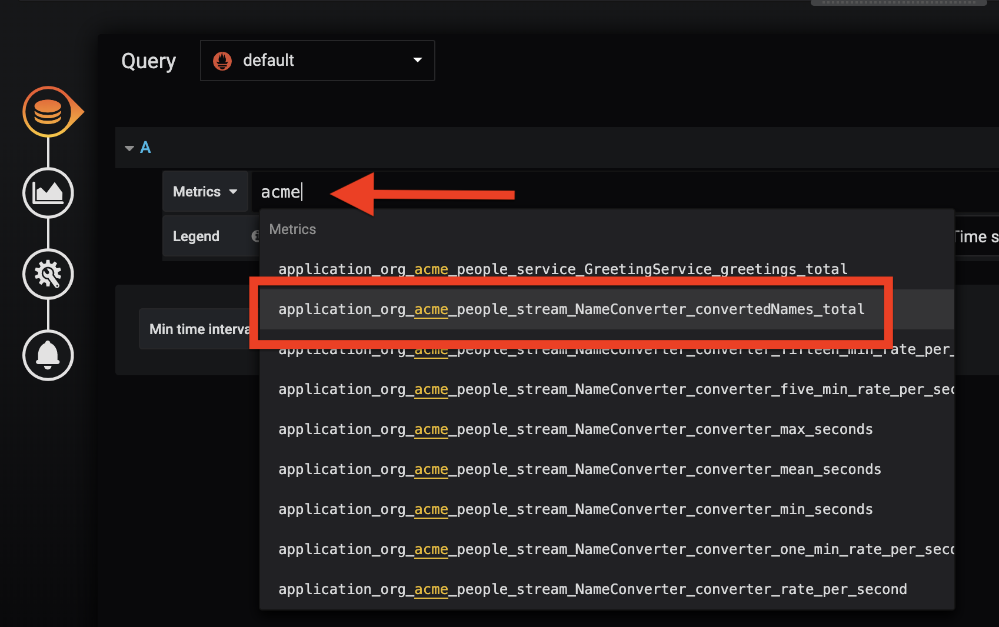

Look for the one ending in `convertedNames_total` and select it. Click the Refresh button in the upper right:

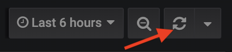

The metrics should immediately begin to show in the graph above:

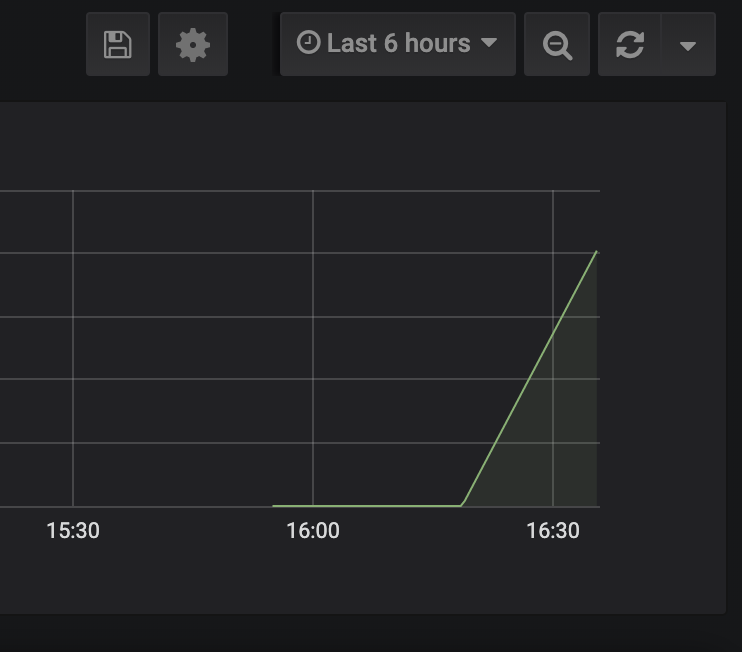

Next click on the Visualization tab on the left:

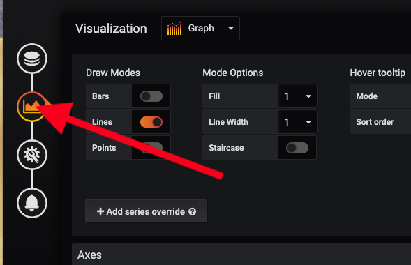

This lets you fine tune the display, along with the type of graph (bar, line, gauge, etc). Leave them for now, and click on the General tab. Change the name of the panel to `Converted Names`.

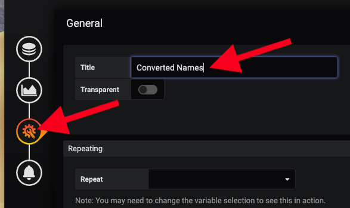

There is an Alerts tab you can configure to send alerts (email, etc) when conditions are met for this and other queries. We’ll skip this for now.

Click the Save icon at the top to save our new dashboard, enter `Quarkus Metrics Dashboard` as its name (you can actually name it any name you want, it will show up in a list of dashboards later on).

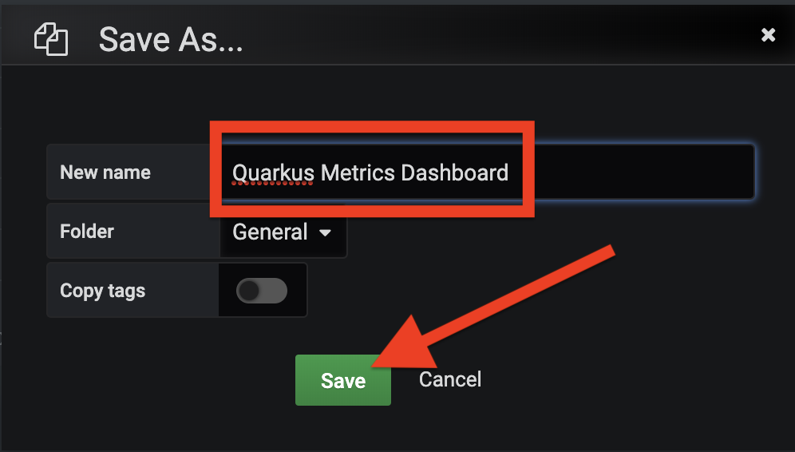

Click Save.

## 15. Add more Panels

See if you can add additional Panels to your new Dashboard. Use the Add Panel button to add a new Panel

## 16. Fix layout

After saving, go back to the main dashboard (click on My Dashboard at the top and then select it under Recent Dashboards). Change the time value to Last 30 Minutes at the top-right:

Beautiful, and useful! You can add many more metrics to monitor and alert for Quarkus apps using these tools.

## 17. Congratulations!
This exercise demonstrates how your Quarkus application can utilize the MicroProfile Metrics specification through the SmallRye Metrics extension. You also consumed these metrics using a popular monitoring stack with Prometheus and Grafana.

There are many more possibilities for application metrics, and it’s a useful way to not only gather metrics, but act on them through alerting and other features of the monitoring stack you may be using.