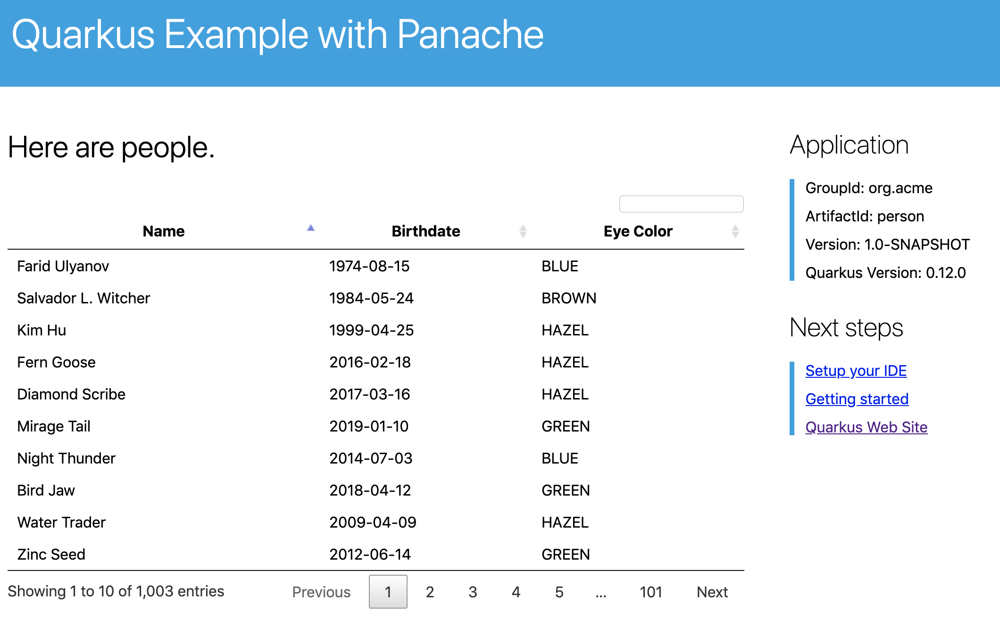

# Tracing Quarkus Apps

This exercise shows how your Quarkus application can utilize Eclipse MicroProfile OpenTracing to provide distributed tracing for interactive web applications.

> In a distributed cloud-native application, multiple microservices are collaborating to deliver the expected functionality. If you have hundreds of services, how do you debug an individual request as it travels through a distributed system? For Java enterprise developers, the Eclipse MicroProfile OpenTracing specification makes it easier. Let’s find out how.

## 1. Install Jaeger

Jaeger is a distributed tracing system originally created by Uber (the ride sharing company). It is used for monitoring and troubleshooting microservices-based distributed systems, including:

- Distributed context propagation

- Distributed transaction monitoring

- Root cause analysis

- Service dependency analysis

- Performance / latency optimization

Jaeger exposes a collector through which apps (like our People app) report tracing details. Jaeger stores and reports on this tracing activity.

> What are Traces and Spans?
>
> At the highest level, a trace tells the story of a transaction or workflow as it propagates through a (potentially distributed) system. A trace is a directed acyclic graph (DAG) of spans: named, timed operations representing a contiguous segment of work in that trace.
>
> Each component (microservice) in a distributed trace will contribute its own span or spans.
>

Jaeger is installed and managed through its Kubernetes Operator (just like AMQ Streams and Kafka that you used in previous exercises).

First, on the OpenShift UI, Developer view, click **+Add** and, then From Catalog:


Type in jaeger in the keyword filter box:


Click on **Jaeger**, and then click on **Create**. This will open a yaml file for you to configure the Jaeger service before it’s installed.

Change the *metadata > name* value to `jaeger` as shown, and click Create:


This will create a new `Jaeger` Kubernetes object in your namespace, triggering the Operator to deploy Jaeger. In the Topology view, you’ll see Jaeger spin up:

Jaeger exposes its collector at different ports for different protocols. Most use the HTTP collector at `jaeger-collector:14268` but other protocols like gRPC are also supported on different ports. You can see them by clicking on the Jaeger circle and clicking the Resources tab:


The endpoint on port `14268` is the one we’ll use for our app.

## 2. Add Tracing to Quarkus

With Jaeger installed, let’s turn back to our Quarkus app. Like other exercises, we’ll need another extension to enable tracing in our app. Install it with:

```
mvn quarkus:add-extension -Dextensions="opentracing, rest-client" -f $CHE_PROJECTS_ROOT/quarkus-workshop-labs
```
([^ execute](didact://?commandId=vscode.didact.sendNamedTerminalAString&text=curlTerm$$mvn%20quarkus:add-extension%20-Dextensions="opentracing,rest-client"%20-f%20.&completion=mvn%20quarkus:add-extension "Opens a new terminal and sends the command above"){.didact})

This will add the necessary entries in your pom.xml to bring in the OpenTracing capability, and an HTTP REST Client we’ll use later.

## 3. Configure Quarkus

Next, open the `application.properties` file ([open](didact://?commandId=vscode.openFolder&projectFilePath=src/main/resources/application.properties&completion=Opened%20the%20application.properties%20file "Opens the application.properties file"){.didact}). Add the following lines to it to configure the default Jaeger tracer in Quarkus:

```
quarkus.jaeger.service-name=people
quarkus.jaeger.sampler-type=const
quarkus.jaeger.sampler-param=1
quarkus.jaeger.endpoint=http://jaeger-collector:14268/api/traces
```
- First entry, The name of our service from the perspective of Jaeger (useful when multiple apps report to the same Jaeger instance)
- Second and Third entry, How Jaeger samples traces. Other options exist to tune the performance.
- Forth entry, This is the default HTTP-based collector exposed by Jaeger

## 4. Test it out

Like many other Quarkus frameworks, sensible defaults and out of the box functionality means you can get immediate value out of Quarkus without changing any code. By default, all JAX-RS endpoints (like our `/hello` and others) are automatically traced. Let’s see that in action by re-deploying our traced app.

## 5. Rebuild Executable JAR

Now we are ready to run our application on the cluster and look at the generated metrics. Let's start with rebuilding the JAR.

```
mvn -DskipTests clean package -Pnative -Dquarkus.native.container-build=true
```

([^ execute](didact://?commandId=vscode.didact.sendNamedTerminalAString&text=QNativeTerm$$mvn%20-Dskiptests%20clean%20package%20-Pnative%20-Dquarkus.native.container-build=true&completion=Run%20Quarkus%20native%20mode. "Opens a new terminal and sends the command above"){.didact})

Let’s deploy our app to the cluster! To do this, start the container build using our executable JAR:

```
oc start-build people --from-file target/*-runner.jar --follow
```
([^ execute](didact://?commandId=vscode.didact.sendNamedTerminalAString&text=ocTerm$$oc%20start-build%20people%20--from-file%20target/*-runner%20--follow&completion=Run%20oc%20start-build%20command. "Opens a new terminal and sends the command above"){.didact})

This will re-build the image by starting with the OpenJDK base image, adding in our executable JAR, and packaging the result as a container image on the internal registry. Wait for the build to finish.


## 6. Confirm deployment

The rebuild will also trigger a re-deployment of our app. 

You’ll see in the Topology view that the app is re-deployed with the new settings and the old app will be terminated soon after:


You should see a bunch of log output that ends with a SUCCESS message.

Run the command
```
oc rollout status -w dc/people
```
([^ execute](didact://?commandId=vscode.didact.sendNamedTerminalAString&text=ocTerm$$oc%20rollout%20status%20-w%20dc/people&completion=oc%20rollout%20command "Opens a new terminal and sends the command above"){.didact})

## 7. Trigger traces

You’ll need to trigger some HTTP endpoints to generate traces. 
Access the datatable route url by running the command below

```
oc get route people -o=go-template --template='{{ .spec.host }}'/datatable.html ; echo ''
```
Open the URL in browser.




Exercise the table a bit by paging through the entries and using various search terms to force several RESTful calls back to our app:

## 8. Inspect traces

Open the Jaeger url in browser, use the command output below and pick the route url for the name "jaeger" as shown in the picture.

```
oc get route people -o=go-template --template='{{ .spec.host }}'/datatable.html ; echo ''
```


By default Jaeger uses the same login details as OpenShift, so click the Login with OpenShift button, enter your credentials:

Then, click **Allow Selected Permissions** to allow Jaeger to access your account details. You’ll end up on the Jaeger query page:


Using the menu on the left, select the `people` Service, and click Find Traces. Jaeger will show the collected traces on the right:

> If you do not see `people` in the Service drop-down, ensure your changes to `application.properties` to add Jaeger configuration is correct, and reload the Jaeger UI.


Click on one of the traces from "a few seconds ago" to show the individual spans of each trace:


You can see that this trace (along with the others) shows the incoming HTTP GET operation to the `/datatable` endpoint we created earlier, along with the time it took, and other ancillary info about the request. Not terribly interesting as it’s a single call, but you can imagine with a real world app and multiple microservices working together, that traces could reveal a lot of detail.

> Service Mesh technologies like Istio can provide even more tracing prowess as the calls across different services are traced at the network level, not requiring any frameworks or developer instrumentation to be enabled for tracing.

## 9. Congratulations!
You’ve seen how to enable automatic tracing for JAX-RS methods as well as create custom tracers for non-JAX-RS methods and external services by using MicroProfile OpenTracing. This specification makes it easy for Quarkus developers to instrument services with distributed tracing for learning, debugging, performance tuning, and general analysis of behavior.