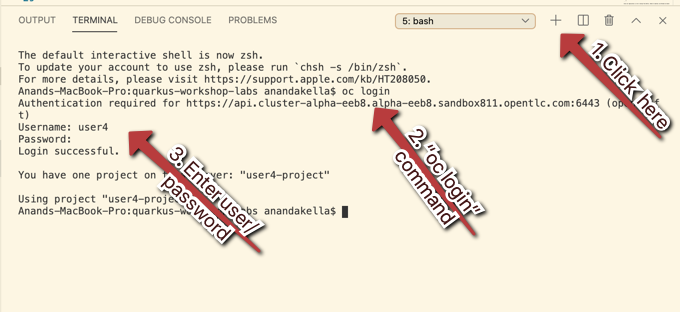

# Securing Quarkus APIs

Bearer Token Authorization is the process of authorizing HTTP requests based on the existence and validity of a bearer token representing a subject and her access context, where the token provides valuable information to determine the subject of the call as well whether or not a HTTP resource can be accessed. This is commonly used in OAuth-based identity and access management systems like `Keycloak`, a popular open source project. In this exercise we’ll show you how to use `Microprofile JSON Web Token (JWT) RBAC`, `Keycloak` and `OAuth` to secure your Quarkus applications.

## 1. Add JWT to Quarkus
Like other exercises, we’ll need another extension to enable the use of MicroProfile JWT. Install it with:

```
mvn quarkus:add-extension -Dextensions="jwt" -f $CHE_PROJECTS_ROOT/quarkus-workshop-labs
```
([^ execute](didact://?commandId=vscode.didact.sendNamedTerminalAString&text=curlTerm$$mvn%20quarkus:add-extension%20-Dextensions="jwt"%20-f%20.&completion=Run%20Quarkus%20add-extension%20command. "Opens a new terminal and sends the command above"){.didact})

This will add the necessary entries in your pom.xml to bring in JWT support.

## 2. Configure Quarkus for MicroProfile JWT

Some configuration of the extension is required. Add this to your application.properties ([open](didact://?commandId=vscode.openFolder&projectFilePath=src/main/resources/application.properties&completion=Opened%20the%20application.properties%20file "Opens the application.properties file"){.didact}):

```
mp.jwt.verify.publickey.location=http://keycloak-openshift-url.com/auth/realms/quarkus/protocol/openid-connect/certs
mp.jwt.verify.issuer=http://keycloak-openshift-url.com/auth/realms/quarkus
quarkus.smallrye-jwt.auth-mechanism=MP-JWT
quarkus.smallrye-jwt.realm-name=quarkus
quarkus.smallrye-jwt.enabled=true
```

- Sets public key location for JWT authentication. Keycloak exports this for you at the URL.
- Issuer URL. This must match the incoming JWT iss claims or else authentication fails.
- Sets authentication mechanism name to MP-JWT, the MicroProfile JWT RBAC specification standard name for the token based authentication mechanism.

## 3. Create protected endpoints

We’ll create 2 JWT-protected endpoints. Create a new class file `JWTResource.java` ([open](didact://?commandId=vscode.openFolder&projectFilePath=src/main/java/org/acme/people/rest/JWTResource.java&completion=Opened%20the%20JWTResource.java%20file "Opens the JWTResource.java file"){.didact}) in the `org.acme.people.rest` package and check the code.

```
package org.acme.people.rest;

import java.security.Principal;
import java.util.Optional;

import javax.annotation.security.RolesAllowed;
import javax.enterprise.context.RequestScoped;
import javax.inject.Inject;
import javax.json.JsonString;
import javax.ws.rs.GET;
import javax.ws.rs.Path;
import javax.ws.rs.Produces;
import javax.ws.rs.core.Context;
import javax.ws.rs.core.MediaType;
import javax.ws.rs.core.SecurityContext;

import org.eclipse.microprofile.jwt.Claim;
import org.eclipse.microprofile.jwt.Claims;
import org.eclipse.microprofile.jwt.JsonWebToken;

@Path("/secured")
@RequestScoped 
public class JWTResource {

    @Inject
    JsonWebToken jwt;  

    @Inject
    @Claim(standard = Claims.iss)
    Optional<JsonString> issuer; 

    @GET
    @Path("/me")
    @RolesAllowed("user")
    @Produces(MediaType.TEXT_PLAIN)
    public String me(@Context SecurityContext ctx) {  
        Principal caller = ctx.getUserPrincipal();
        String name = caller == null ? "anonymous" : caller.getName();
        boolean hasJWT = jwt != null;
        return String.format("hello %s, isSecure: %s, authScheme: %s, hasJWT: %s\n", name, ctx.isSecure(), ctx.getAuthenticationScheme(), hasJWT);
    }

    @GET
    @Path("/me/admin")
    @RolesAllowed("admin")
    @Produces(MediaType.TEXT_PLAIN)
    public String meJwt(@Context SecurityContext ctx) {   
        Principal caller = ctx.getUserPrincipal();
        String name = caller == null ? "anonymous" : caller.getName();
        boolean hasJWT = jwt != null;

        final StringBuilder helloReply = new StringBuilder(String.format("hello %s, isSecure: %s, authScheme: %s, hasJWT: %s\n", name, ctx.isSecure(), ctx.getAuthenticationScheme(), hasJWT));
        if (hasJWT && (jwt.getClaimNames() != null)) {
            helloReply.append("Injected issuer: [" + issuer.get() + "]\n"); 
            jwt.getClaimNames().forEach(n -> {
                helloReply.append("\nClaim Name: [" + n + "] Claim Value: [" + jwt.getClaim(n) + "]");
            });
        }
        return helloReply.toString();
    }
}
```
```
Adds a @RequestScoped as Quarkus uses a default scoping of ApplicationScoped and this will produce undesirable behavior since JWT claims are naturally request scoped.
JsonWebToken provides access to the claims associated with the incoming authenticated JWT token.
When using JWT Authentication, claims encoded in tokens can be @Inject ed into your class for convenient access.
The /me and /me/admin endpoints demonstrate how to access the security context for Quarkus apps secured with JWT. Here we are using a @RolesAllowed annotation to make sure that only users granted a specific role can access the endpoint.
Use of injected JWT Claim to print the all the claims
```
## 4. Rebuild and redeploy app

First, re-build the app using the Package App for OpenShift:

```
mvn -DskipTests clean package -Pnative -Dquarkus.native.container-build=true
```
([^ execute](didact://?commandId=vscode.didact.sendNamedTerminalAString&text=QuarkusTerm$$mvn%20-Dskiptests%20clean%20package%20-Pnative%20-Dquarkus.native.container-build=true&completion=Run%20Quarkus%20native%20mode. "Opens a new terminal and sends the command above"){.didact})

In Visual Studio Code, login to OpenShift as shown in the diagram below:



- `oc login`(enter the proper username and password)([^ execute](didact://?commandId=vscode.didact.sendNamedTerminalAString&text=ocTerm$$oc%20login&completion=Run%20oc%20login%20command. "Opens a new terminal and sends the command above"){.didact})(enter the proper username and password)
- `oc project xxxx` (select the project where you want the Quarkus demo deployments)

Once that’s done, run the following command to re-deploy:

```
oc start-build people --from-file target/*-runner.jar --follow
```
([^ execute](didact://?commandId=vscode.didact.sendNamedTerminalAString&text=ocTerm$$oc%20start-build%20people%20--from-file%20target/*-runner%20--follow&completion=Run%20oc%20start-build%20command. "Opens a new terminal and sends the command above"){.didact})

This step will combine the native binary with a base OS image, create a new container image, and push it to an internal image registry. Wait for it to finish!. You should get a Push successful message at the end.


## 5. Confirm deployment

Finally, make sure it’s actually done rolling out:
```
oc rollout status -w dc/people
```
([^ execute](didact://?commandId=vscode.didact.sendNamedTerminalAString&text=ocTerm$$oc%20rollout%20status%20-w%20dc/people&completion=Run%20oc%20rollout%20command. "Opens a new terminal and sends the command above"){.didact})


## 6. Test endpoints

> In this exercise we are short-circuiting typical **web authentication flows** to illustrate the ease of protecting APIs with Quarkus. In a typical web authentication, users are redirected (via their browser) to a login page, after which a negotiation is performed to retrieve access tokens used on behalf of the user to access protected resources. Here we are doing this manually with `curl`.

The first thing to do to test any endpoint is obtain an access token from your authentication server in order to access the application resources. We’ve pre-created a few users in Keycloak for you to use:

- `alice` is an ordinary user (will have the `user` role) whose password is `alice`

- `admin` is an Administrator (has the `admin` and `user` role) and their password is `admin`

- `jdoe` is an ordinary user (has the `user` role) but has also been granted access to `confidential` endpoints in Keycloak, and their password is `jdoe`

Try to access the endpoint as an anonymous unauthenticated user:

```
curl -i http://$(oc get route people -o=go-template --template='{{ .spec.host }}')/secured/me
```
([^ execute](didact://?commandId=vscode.didact.sendNamedTerminalAString&text=curlTerm$$curl%20-i%20http://$(oc%20get%20route%20people%20-o=go-template%20--template='{{.spec.host}}')/secured/me;echo%20''&completion=Run%20curl%20command. "Opens a new terminal and sends the command above"){.didact})

It should fail with:

```
HTTP/1.1 401 Unauthorized
www-authenticate: Bearer {token}
Content-Length: 0
Set-Cookie: 2a1b392100b8b2cb3705c68f4ecbaf66=1b3560b80b9fad566e105aff1f31f880; path=/; HttpOnly
```

Let’s try with an authenticated user next.

## 7. Test Alice

Get a token for user `alice` with this command:

```
export ALICE_TOKEN=$(\
    curl -s -X POST http://keycloak-codeready.apps.cluster-alpha-eeb8.alpha-eeb8.sandbox811.opentlc.com/auth/realms/quarkus/protocol/openid-connect/token \
    --user backend-service:secret \
    -H 'content-type: application/x-www-form-urlencoded' \
    -d 'username=alice&password=alice&grant_type=password' | jq --raw-output '.access_token' \
 ) && echo $ALICE_TOKEN
```

This issues a `curl` command to Keycloak (using `backend-service` credentials which is a special user that is allowed acess to the Keycloak REST API), and fetches a token for Alice using their credentials.

Try out the JWT-secured API as Alice:

```
curl -i http://$(oc get route people -o=go-template --template='{{ .spec.host }}')/secured/me \
  -H "Authorization: Bearer $ALICE_TOKEN"
```

You should see:

```
HTTP/1.1 200 OK
Content-Length: 63
Content-Type: text/plain;charset=UTF-8
Set-Cookie: 2a1b392100b8b2cb3705c68f4ecbaf66=1b3560b80b9fad566e105aff1f31f880; path=/; HttpOnly
Cache-control: private

hello alice, isSecure: false, authScheme: Bearer, hasJWT: true
```

Now try to access the `/me/admin` endpoint as `alice`:

```
curl -i http://$(oc get route people -o=go-template --template='{{ .spec.host }}')/secured/me/admin \
  -H "Authorization: Bearer $ALICE_TOKEN"
```

You’ll get:

```
HTTP/1.1 403 Forbidden
Content-Length: 9
Content-Type: text/plain;charset=UTF-8
Set-Cookie: 2a1b392100b8b2cb3705c68f4ecbaf66=1b3560b80b9fad566e105aff1f31f880; path=/; HttpOnly

Forbidden
```

Alice is not an admin. Let’s try with admin!

> Access Tokens have a defined lifespan that’s typically short (e.g. 5 minutes), so if you wait too long, the token will expire and you’ll get denied access. In this case, just re-fetch a new token using the same curl command used the first time. Full-fledged applications can take advantage of things like **Refresh Tokens** to do this automatically to ensure a good user experience even for slow users.

## 8. Test Admin

Obtain an Admin token:

```
export ADMIN_TOKEN=$(\
    curl -s -X POST http://keycloak-codeready.apps.cluster-alpha-eeb8.alpha-eeb8.sandbox811.opentlc.com/auth/realms/quarkus/protocol/openid-connect/token \
    --user backend-service:secret \
    -H 'content-type: application/x-www-form-urlencoded' \
    -d 'username=admin&password=admin&grant_type=password' | jq --raw-output '.access_token' \
 ) && echo $ADMIN_TOKEN
```

And try again with your new token:

```
curl -i http://$(oc get route people -o=go-template --template='{{ .spec.host }}')/secured/me/admin \
  -H "Authorization: Bearer $ADMIN_TOKEN"
```

You should see:

```
HTTP/1.1 200 OK
Content-Length: 2256
Content-Type: text/plain;charset=UTF-8
Set-Cookie: 2a1b392100b8b2cb3705c68f4ecbaf66=1b3560b80b9fad566e105aff1f31f880; path=/; HttpOnly
Cache-control: private

hello admin, isSecure: false, authScheme: Bearer, hasJWT: true
Injected issuer: ["http://keycloak-codeready.apps.cluster-alpha-eeb8.alpha-eeb8.sandbox811.opentlc.com/auth/realms/quarkus"]

Claim Name: [sub] Claim Value: [af134cab-f41c-4675-b141-205f975db679]
Claim Name: [groups] Claim Value: [[admin, user]]
Claim Name: [typ] Claim Value: [Bearer]
Claim Name: [preferred_username] Claim Value: [admin]
... <more claims>
```

Success! We dump all of the claims from the JWT token for inspection.

## 9. Using Keycloak Authentication

Frequently, resource servers only perform authorization decisions based on role-based access control (RBAC), where the roles granted to the user trying to access protected resources are checked against the roles mapped to these same resources. While roles are very useful and used by applications, they also have a few limitations:

- Resources and roles are tightly coupled and changes to roles (such as adding, removing, or changing an access context) can impact multiple resources

- Changes to your security requirements can imply deep changes to application code to reflect these changes

- Depending on your application size, role management might become difficult and error-prone

Keycloak’s Authorization Services provides fine-grained authorization policies that decouples the authorization policy from your code, so when your policies change, your code doesn’t have to. In this exercise we’ll use Keycloak’s Authorization Services to protect our Quarkus APIs.

## 10. Enable Quarkus Keycloak and OpenID Connect Extensions

First, you’ll need to enable the Keycloak extension by running this command in a Terminal:

```
mvn quarkus:add-extension -Dextensions="oidc, keycloak-authorization" -f $CHE_PROJECTS_ROOT/quarkus-workshop-labs
```
([^ execute](didact://?commandId=vscode.didact.sendNamedTerminalAString&text=QuarkusTerm$$mvn%20quarkus:add-extension%20-Dextensions="oidc,keycloak-authorization"%20-f%20.&completion=mvn%20quarkus:add-extension "Opens a new terminal and sends the command above"){.didact})

## 11. Disable MicroProfile JWT Extension

Since we will use Keycloak authentication rather than JWT, we’ll need to disable the JWT extension. Open the `pom.xml` ([open](didact://?commandId=vscode.openFolder&projectFilePath=pom.xml&completion=Opened%20the%20pom.xml%20file "Opens the pom.xml file"){.didact})file and delete or comment the `quarkus-smallrye-jwt` dependency.

## 12. Configuring Keycloak

Next, add these to your `application.properties` ([open](didact://?commandId=vscode.openFolder&projectFilePath=src/main/resources/application.properties&completion=Opened%20the%20application.properties%20file "Opens the application.properties file"){.didact}) for Keycloak:

```
# OIDC config
quarkus.oidc.auth-server-url=http://keycloak-codeready.apps.cluster-alpha-eeb8.alpha-eeb8.sandbox811.opentlc.com/auth/realms/quarkus
quarkus.oidc.client-id=backend-service
quarkus.oidc.credentials.secret=secret
quarkus.http.cors=true

# Enable Policy Enforcement
quarkus.keycloak.policy-enforcer.enable=true
quarkus.keycloak.policy-enforcer.paths.ready.name=Readiness
quarkus.keycloak.policy-enforcer.paths.ready.path=/health/ready
quarkus.keycloak.policy-enforcer.paths.ready.enforcement-mode=DISABLED
quarkus.keycloak.policy-enforcer.paths.live.name=Liveness
quarkus.keycloak.policy-enforcer.paths.live.path=/health/live
quarkus.keycloak.policy-enforcer.paths.live.enforcement-mode=DISABLED
```

This configures the extension with the necessary configurations.

> We explicitly disable authorization checks for the `/health/*` endpoints so that the container platform can access them. To support secured health checks, different health check mechanisms like TCP or `exec` methods can be used.

## 13. Create Keycloak endpoints

Check the class file called `KeycloakResource.java`([open](didact://?commandId=vscode.openFolder&projectFilePath=src/main/java/org/acme/people/rest/KeycloakResource.java&completion=Opened%20the%20KeycloakResource.java%20file "Opens the KeycloakResource.java file"){.didact}) in the `org.acme.people.rest` package

```
package org.acme.people.rest;

import javax.inject.Inject;
import javax.ws.rs.GET;
import javax.ws.rs.Path;
import javax.ws.rs.Produces;
import javax.ws.rs.core.MediaType;

import io.quarkus.security.identity.SecurityIdentity;

@Path("/secured") 
public class KeycloakResource {

    @Inject
    SecurityIdentity identity; 


    @GET
    @Path("/confidential") 
    @Produces(MediaType.TEXT_PLAIN)
    public String confidential() {
        return ("confidential access for: " + identity.getPrincipal().getName() +
          " with attributes:" + identity.getAttributes());
    }
}
```
Note that we do not use any @RolesAllowed or any other instrumentation on the endpoint to specify access policy. It looks like an ordinary endpoint. Keycloak (the server) is the one enforcing access here, not Quarkus directly.
The SecurityIdentity is a generic object produced by the Keycloak extension that you can use to obtain information about the security principals and attributes embedded in the request.

## 14. Rebuild and redeploy app

First, re-build the app.

```
mvn -DskipTests clean package -Pnative -Dquarkus.native.container-build=true
```
([^ execute](didact://?commandId=vscode.didact.sendNamedTerminalAString&text=QuarkusTerm$$mvn%20-Dskiptests%20clean%20package%20-Pnative%20-Dquarkus.native.container-build=true&completion=Run%20Quarkus%20native%20mode. "Opens a new terminal and sends the command above"){.didact})

In Visual Studio Code, login to OpenShift as shown in the diagram below:


- `oc login`(enter the proper username and password)([^ execute](didact://?commandId=vscode.didact.sendNamedTerminalAString&text=ocTerm$$oc%20login&completion=Run%20oc%20login%20command. "Opens a new terminal and sends the command above"){.didact})(enter the proper username and password)
- `oc project xxxx` (select the project where you want the Quarkus demo deployments)

Once that’s done, run the following command to re-deploy:

```
oc start-build people --from-file target/*-runner.jar --follow
```
([^ execute](didact://?commandId=vscode.didact.sendNamedTerminalAString&text=ocTerm$$oc%20start-build%20people%20--from-file%20target/*-runner%20--follow&completion=Run%20oc%20start-build%20command. "Opens a new terminal and sends the command above"){.didact})

This step will combine the native binary with a base OS image, create a new container image, and push it to an internal image registry. Wait for it to finish!. You should get a Push successful message at the end.


## 15. Confirm deployment

Finally, make sure it’s actually done rolling out:
```
oc rollout status -w dc/people
```
([^ execute](didact://?commandId=vscode.didact.sendNamedTerminalAString&text=ocTerm$$oc%20rollout%20status%20-w%20dc/people&completion=Run%20oc%20rollout%20command. "Opens a new terminal and sends the command above"){.didact})

## 16. Test confidential

The `/secured/confidential` endpoint is protected with a policy defined in the Keycloak Server. The policy only grants access to the resource if the user is granted with a `confidential` role. The difference here is that the application is delegating the access decision to Keycloak, so no explicit source code instrumentation is required.

> Keycloak caches the resource paths that it is protecting, so that every access doesn’t cause a roundtrip back to the server to check whether the user is authorized to access the resource. The lifespan of these cached entries can be controlled through Policy Enforcer Configuration.

First make sure even `admin` can’t access the endpoint:

Refresh the admin token (it may have expired):

```
export ADMIN_TOKEN=$(\
    curl -s -X POST http://keycloak-codeready.apps.cluster-alpha-eeb8.alpha-eeb8.sandbox811.opentlc.com/auth/realms/quarkus/protocol/openid-connect/token \
    --user backend-service:secret \
    -H 'content-type: application/x-www-form-urlencoded' \
    -d 'username=admin&password=admin&grant_type=password' | jq --raw-output '.access_token' \
 ) && echo $ADMIN_TOKEN
```

And then try to access with it:

```
curl -i -X GET \
  http://$(oc get route people -o=go-template --template='{{ .spec.host }}')/secured/confidential \
  -H "Authorization: Bearer $ADMIN_TOKEN"
```

You should see in the returned HTTP headers:

```
HTTP/1.1 403 Forbidden
Connection: keep-alive
Content-Length: 0
Date: Tue, 16 Jul 2019 00:59:56 GMT
```

Failed as expected!

To access the confidential endpoint, you should obtain an access token for user jdoe:

```
export JDOE_TOKEN=$(\
    curl -s -X POST http://keycloak-codeready.apps.cluster-alpha-eeb8.alpha-eeb8.sandbox811.opentlc.com/auth/realms/quarkus/protocol/openid-connect/token \
    --user backend-service:secret \
    -H 'content-type: application/x-www-form-urlencoded' \
    -d 'username=jdoe&password=jdoe&grant_type=password' | jq --raw-output '.access_token' \
 ) && echo $JDOE_TOKEN
```

And access the confidential endpoint with your new token:
```
curl -i -X GET \
  http://$(oc get route people -o=go-template --template='{{ .spec.host }}')/secured/confidential \
  -H "Authorization: Bearer $JDOE_TOKEN"
```

You should see:

```
HTTP/1.1 200 OK
Content-Length: 153
Content-Type: text/plain;charset=UTF-8
Set-Cookie: 2a1b392100b8b2cb3705c68f4ecbaf66=ee5925163f2245aa33c406a14815e450; path=/; HttpOnly
Cache-control: private

confidential access for: jdoe with attributes:{permissions=[Permission {id=99856673-24fa-431b-9e26-93e2113f69db, name=Confidential Resource, scopes=[]}]}
```

Success! Even though our code did not explicitly protect the `/secured/confidential` endpoint, we can protect arbitrary URLs in Quarkus apps when using Keycloak.

## 17. Congratulations!

This exercise demonstrated how your Quarkus application can use MicroProfile JWT in conjunction with Keycloak to protect your JAX-RS applications using JWT claims and bearer token authorization.